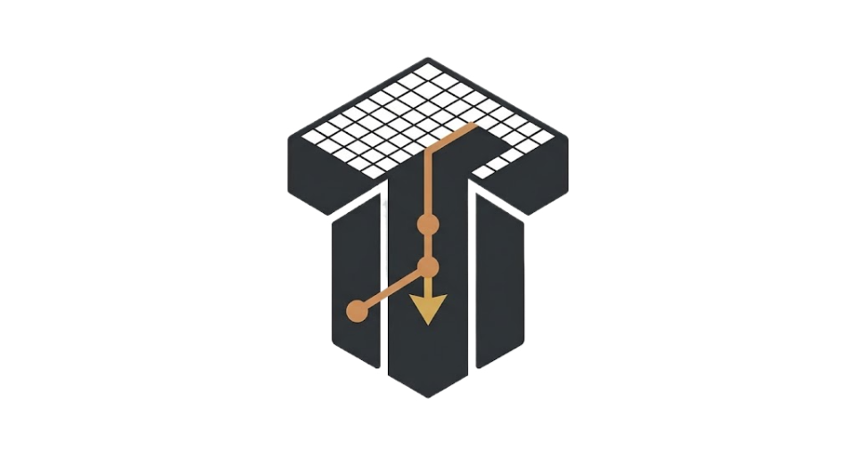
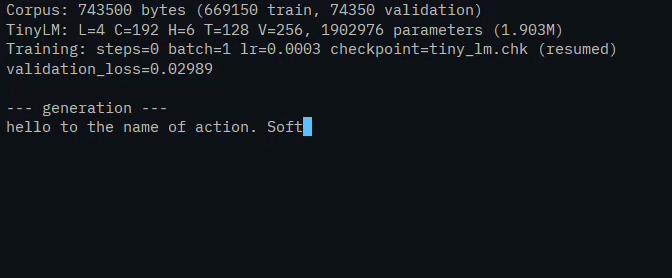
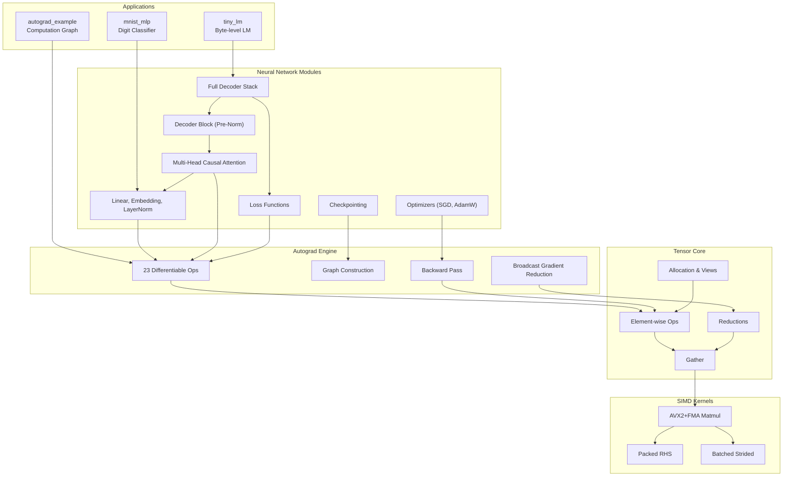
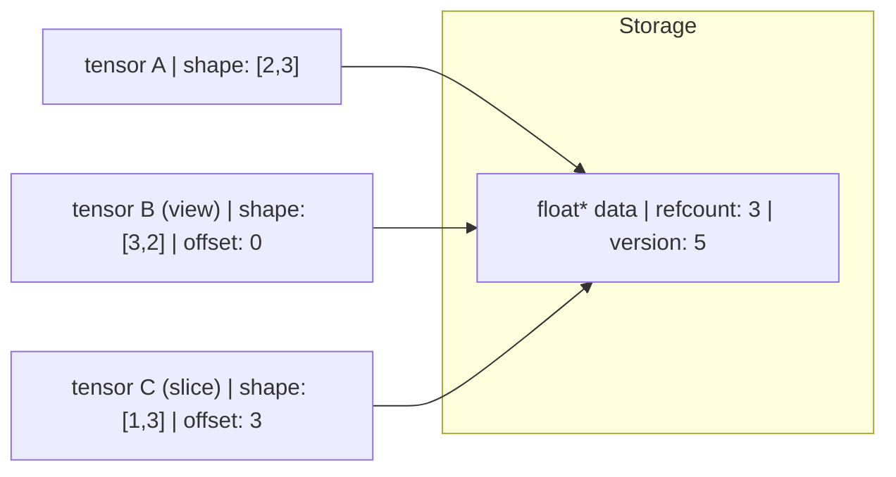
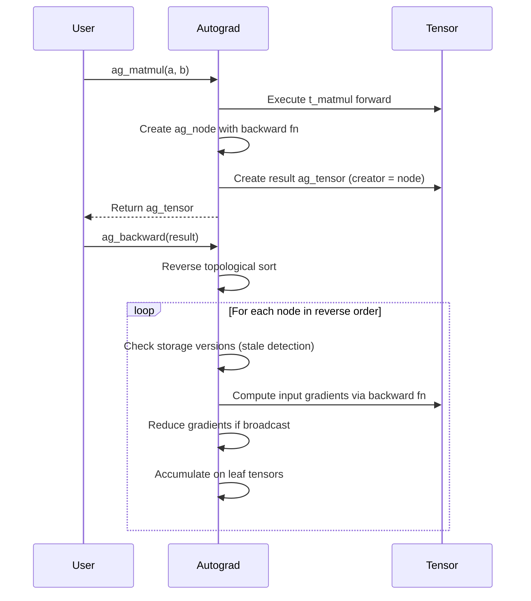
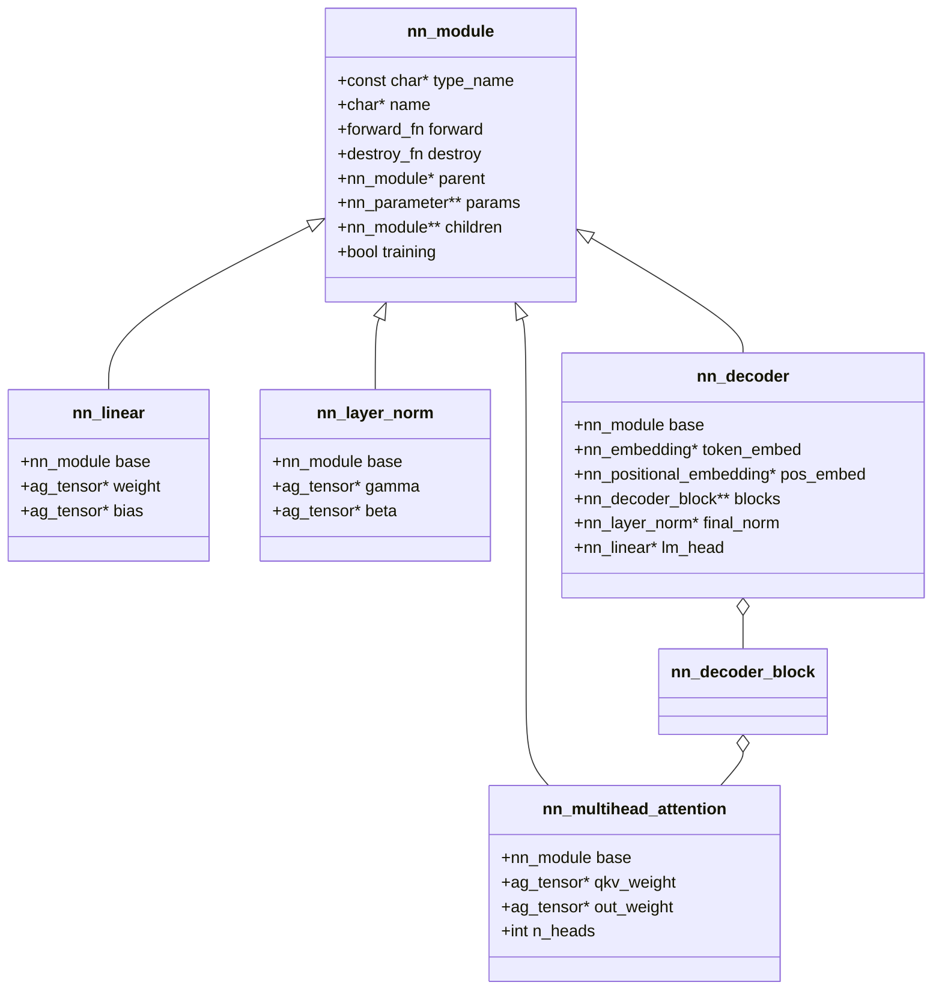
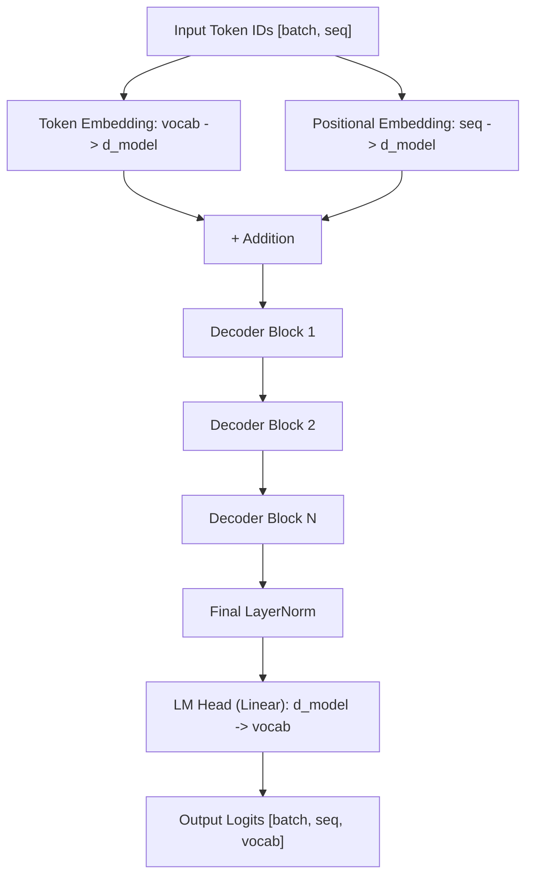
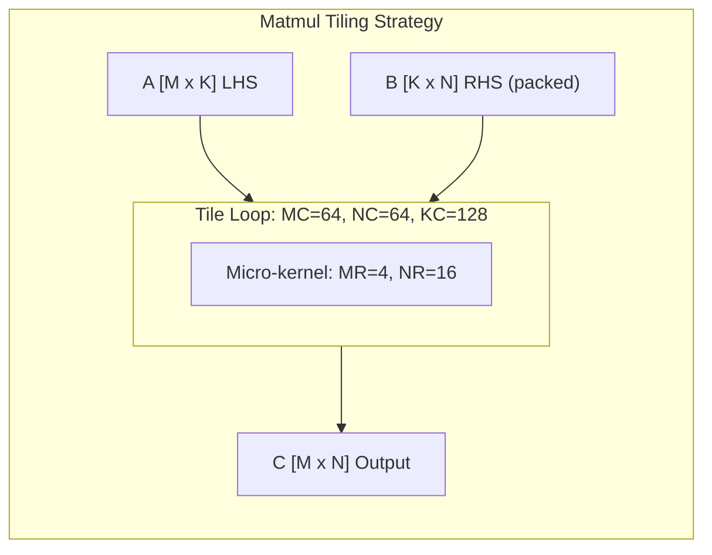

<div align="center">
  
</div>

<h1 align="center">TensorLib</h1>

<p align="center">
  <em>A from-scratch deep learning tensor library written entirely in C</em>
</p>

<p align="center">
  N-dimensional tensors with autograd, Transformer building blocks, loss functions, optimizers, checkpointing, and SIMD-accelerated matmul.
  <br/>
  <strong>Zero external ML dependencies.</strong>
</p>

<p align="center">
  Inspired by
  <a href="https://github.com/pytorch/pytorch">PyTorch</a>,
  <a href="https://github.com/ggerganov/llama.cpp/tree/master/ggml">ggml</a>, and
  <a href="https://github.com/OpenMathLib/OpenBLAS">OpenBLAS</a>.
</p>

<p align="center">
  
</p>

---

## Key Features

- **Tensor Core** — N-dimensional `float32` arrays with NumPy-style broadcasting, zero-copy strided views, and reference-counted storage
- **Autograd Engine** — Dynamic reverse-mode automatic differentiation over 23 differentiable operations with stale-graph detection
- **Neural Network Modules** — Composable module hierarchy with Linear, Embedding, LayerNorm, Dropout, Multi-head Causal Self-Attention, MLP, and full GPT-style Decoder
- **Loss Functions** — Cross-entropy (numerically stable), Softmax, LogSoftmax
- **Optimizers** — SGD and AdamW (decoupled weight decay, bias correction, gradient clipping)
- **Checkpointing** — Versioned, atomic (transaction-safe) binary save/load with optimizer and RNG state
- **SIMD Matmul** — AVX2+FMA blocked micro-kernel with packed-RHS optimization (MR=4, NR=16)
- **Deterministic RNG** — Splitmix64 PRNG with uniform and normal (Box-Muller) distributions
- **CPU only, no Python, no CUDA, no third-party ML libraries**

---

## Architecture



### Layer Summary

| Layer | Files | Lines | Purpose |
|-------|-------|-------|---------|
| **Tensor Core** | 7 `.c` + 2 `.h` | ~1,880 | N-dim tensors, broadcasting, views, matmul |
| **Autograd Engine** | 7 `.c` + 2 `.h` | ~1,122 | Reverse-mode AD, 23 ops, graph traversal |
| **NN Modules** | 14 `.c` + 1 `.h` | ~1,837 | Layers, attention, decoder, module system |
| **Losses** | 1 `.c` | ~131 | Cross-entropy, softmax |
| **Optimizers** | 3 `.c` | ~480 | SGD, AdamW, grad clipping |
| **RNG** | 1 `.c` | ~43 | Splitmix64, uniform, normal |
| **Serialization** | 1 `.c` | ~617 | Checkpoint save/load |
| **Total** | 34 files | ~6,110 | |

---

## Documentation

Comprehensive documentation is available for each component:

| Document | Description |
|----------|-------------|
| [**Tensor Mechanics**](docs/tensor_mechanics.md) | Storage model, strided views, broadcasting, AVX2 matmul kernel, API reference |
| [**Autograd Engine**](docs/autograd_engine.md) | Computation graph, 23 differentiable ops, backward pass algorithm, gradient reduction |
| [**Neural Network Modules**](docs/neural_network_modules.md) | Module system, all layers, loss functions, optimizers, checkpointing |
| [**Decoder Implementation**](docs/decoder_implementation.md) | GPT-style decoder stack, multi-head attention, causal masking, training guide |

---

## Component Deep-Dive

### Tensor Core

Fixed-precision (`float32`) n-dimensional arrays with:

- **Strided layout** — element accessed via `offset + sum(coords[i] * strides[i])`
- **Zero-copy views** — reshape, transpose, slice, squeeze, expand share storage
- **Reference counting** — storage freed when last tensor is destroyed
- **Version counter** — detects stale computation graphs in autograd
- **Broadcasting** — right-aligned NumPy-style broadcasting for all element-wise ops



See [tensor_mechanics.md](docs/tensor_mechanics.md) for the full tensor API, broadcasting rules, and AVX2 matmul kernel internals.

### Autograd Engine

Dynamic reverse-mode automatic differentiation — the graph is built eagerly during forward execution:



See [autograd_engine.md](docs/autograd_engine.md) for the full algorithm including broadcast-gradient reduction and transactional error handling.

### Neural Network Modules

C-style OOP module system with function-pointer dispatch:



See [neural_network_modules.md](docs/neural_network_modules.md) for all layers, loss functions, optimizers, and checkpointing.

### Decoder Stack

GPT-2-style causal transformer decoder:



Each decoder block follows the pre-norm pattern (GPT-2):
1. LayerNorm -> Multi-Head Causal Self-Attention -> Residual
2. LayerNorm -> MLP (FFN) -> Residual

See [decoder_implementation.md](docs/decoder_implementation.md) for multi-head attention internals, causal masking, and the TinyLM training guide.

---

## Quick Start

### Build

```sh
# CMake (recommended)
cmake -S . -B build -DCMAKE_BUILD_TYPE=Release
cmake --build build --config Release

# Makefile
make          # build and run all tests
make tiny-lm  # build TinyLM example
make mnist    # build MNIST example
```

### Train a Language Model

```sh
./build/tiny_lm corpus.txt --steps 5000 --generate 200 --prompt "To be"
```

4-layer, 192-width, 6-head decoder transformer (~1.9M params) trained with AdamW on raw byte corpora. See [examples/tiny_lm/README.md](examples/tiny_lm/README.md).

### Train an MNIST Classifier

```sh
./build/mnist_mlp
```

784 -> 128 ReLU -> 10 Softmax MLP trained with SGD and cross-entropy loss.

---

## Testing

33 unit test executables covering every component:

```sh
# Run all tests via CMake
cmake --build build --config Release --target test

# Or via Makefile
make test
```

| Category | Tests | Coverage |
|----------|-------|----------|
| Tensor | 6 | Core, alloc, view, ops, reductions, matmul |
| Autograd | 9 | Core, ops, views, gather, reductions, matmul, backward, integration, public API |
| NN Modules | 16 | RNG, parameters, modules, init, linear, embedding, positional, layer norm, dropout, attention, decoder block, decoder, loss, causal mask, checkpoint, MLP |
| Optimizers | 2 | SGD, AdamW |

---

## Performance

### Matmul Benchmarks

Compare TensorLib's blocked AVX2 kernel against OpenBLAS:

```sh
make benchmark-compare
```

The matmul kernel uses a tile-based blocked algorithm:



**Kernel parameters:**
- Micro-kernel: MR=4 rows x NR=16 columns (AVX2: 8 floats x 2 registers)
- Tile sizes: MC=64, NC=64, KC=128
- RHS packing: pre-pack B panels for cache-friendly access
- SIMD: AVX2+FMA with `_mm256_fmadd_ps`

See [tensor_mechanics.md](docs/tensor_mechanics.md) for kernel implementation details.

### Optimization Roadmap

See [optimizations.md](optimizations.md) for the full optimization roadmap covering:
- SIMD vectorization (AVX-512, ARM NEON)
- Kernel fusion (element-wise ops, softmax, LayerNorm)
- OpenMP parallelism
- FlashAttention
- INT8 quantization

---

## Project Structure

```
tensorlib/
├── README.md                     # This file
├── optimizations.md              # SIMD/parallelism optimization roadmap
├── CMakeLists.txt                # CMake build
├── Makefile                      # GNU Make build (GCC, supports PGO)
│
├── include/tensorlib/            # Public API headers
│   ├── tensor.h                  #   Core tensor structs and operations
│   ├── tensor_matmul.h           #   Matmul internals (AVX2 kernel)
│   ├── autograd.h                #   Autograd engine API
│   ├── autograd_internal.h       #   Internal autograd helpers
│   └── nn.h                      #   Neural network module API
│
├── src/                          # Source implementation (32 .c files)
│   ├── tensor/                   #   Tensor ops, views, reductions, matmul
│   ├── autograd/                 #   Autograd forward/backward, graph traversal
│   ├── nn/                       #   Module system, layers, decoder
│   ├── losses/                   #   Cross-entropy, softmax
│   ├── optim/                    #   SGD, AdamW, grad clipping
│   ├── init/                     #   PRNG and weight initialization
│   └── serialization/            #   Checkpoint save/load
│
├── tests/                        # Test suite (33 executables)
│   ├── fixtures/test_common.h    #   Custom test framework
│   └── unit/                     #   Tensor, autograd, nn, optim tests
│
├── examples/                     # Example programs
│   ├── autograd_example.c        #   Computation graph demo
│   ├── tiny_lm/                  #   Byte-level decoder LM (~1.9M params)
│   └── mnsit/                    #   MNIST MLP classifier
│
├── benchmarks/                   # Performance benchmarks
│   └── matmul/                   #   Matmul vs OpenBLAS
│
└── docs/                         # Detailed documentation
    ├── tensor_mechanics.md       #   Tensor layer reference
    ├── autograd_engine.md        #   Autograd engine reference
    ├── neural_network_modules.md #   NN modules reference
    └── decoder_implementation.md #   Decoder implementation reference
```

---

## Build Requirements

- **Compiler:** GCC or Clang with C99 + OpenMP support
- **Flags:** `-O3 -march=native -mtune=native -flto -fopenmp -fno-math-errno -funroll-loops -fprefetch-loop-arrays`
- **Tested on:** GCC via MSYS2 UCRT64 on Windows

---

## Design Philosophy

| Decision | Rationale |
|----------|-----------|
| **C99** | Minimal runtime, direct memory control, portable to embedded systems |
| **No external ML deps** | Self-contained; every algorithm is implemented from scratch |
| **Reference counting** | Deterministic lifetime, no GC pauses, suitable for real-time |
| **Dynamic graph (define-by-run)** | Natural control flow, no tracing step — like PyTorch, unlike TF 1.x |
| **Pre-norm transformer** | Training stability for deep networks (GPT-2 design) |
| **Fused QKV projection** | Better cache locality in attention |
| **Right-aligned broadcasting** | Matches NumPy/PyTorch semantics |
| **Storage version counter** | Detects stale computation graphs between forward and backward |

---

## References & Inspirations

- **[PyTorch](https://github.com/pytorch/pytorch)** — Autograd engine design, nn.Module pattern, storage/stride model
- **[ggml](https://github.com/ggerganov/llama.cpp/tree/master/ggml)** — Tensor struct layout, stride-based operations, kernel dispatch
- **[OpenBLAS](https://github.com/OpenMathLib/OpenBLAS)** — SGemm microkernel tiling strategy, packed-RHS optimization
- **[nanoGPT](https://github.com/karpathy/nanoGPT)** — Decoder architecture, training loop design
- **[NumPy](https://github.com/numpy/numpy)** — Broadcasting semantics, view model
