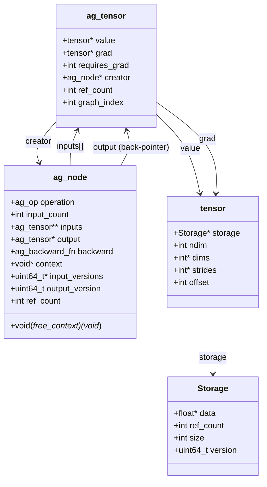
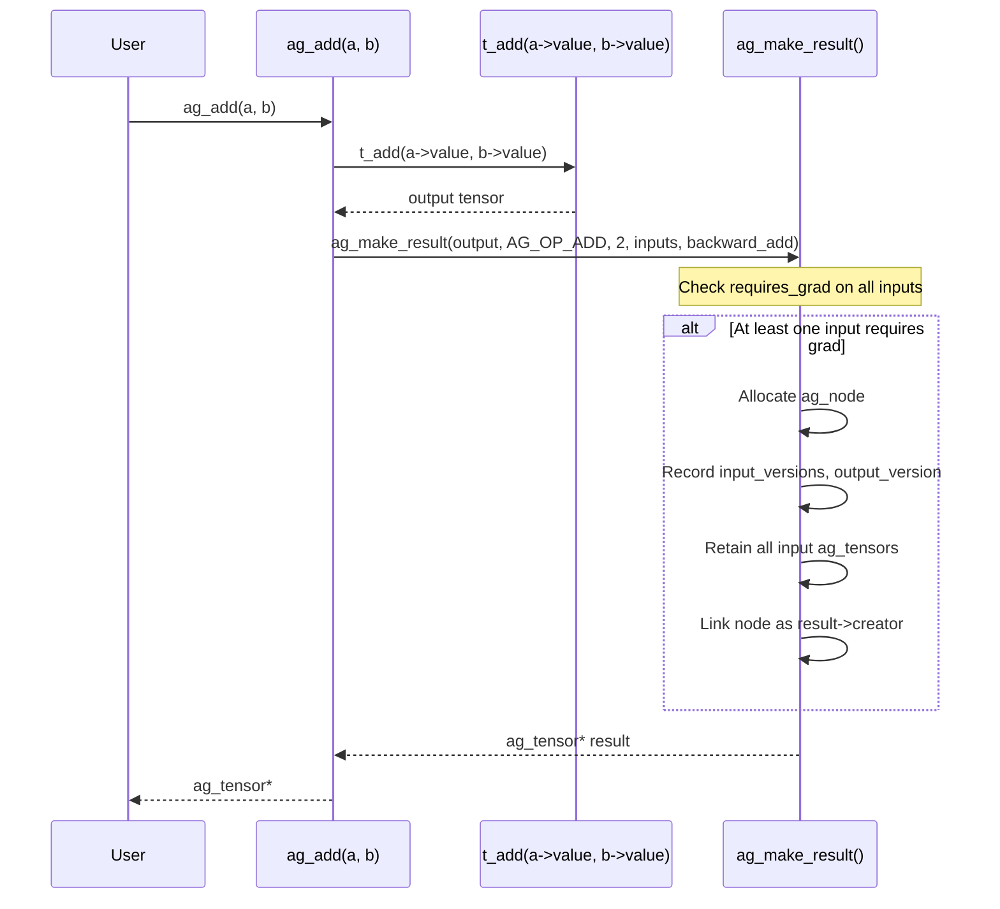
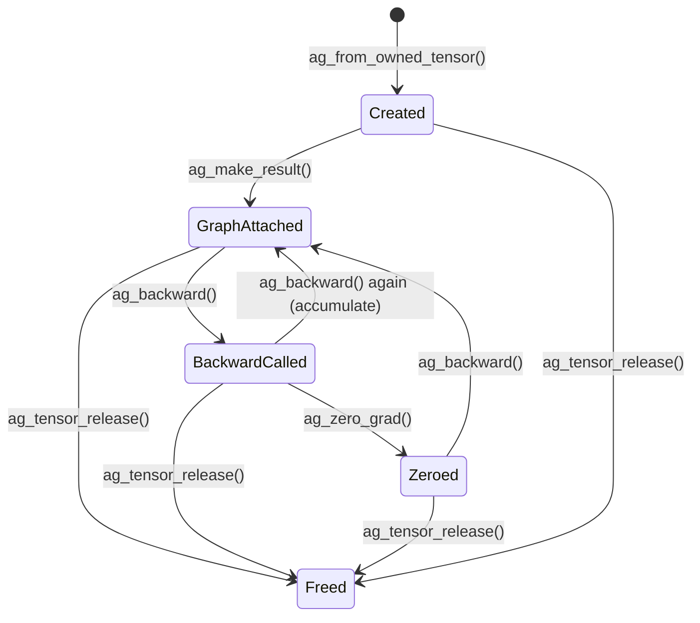
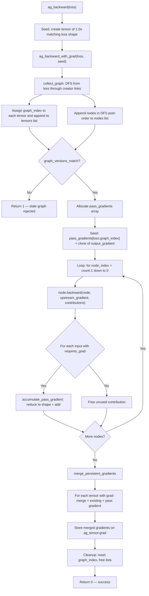
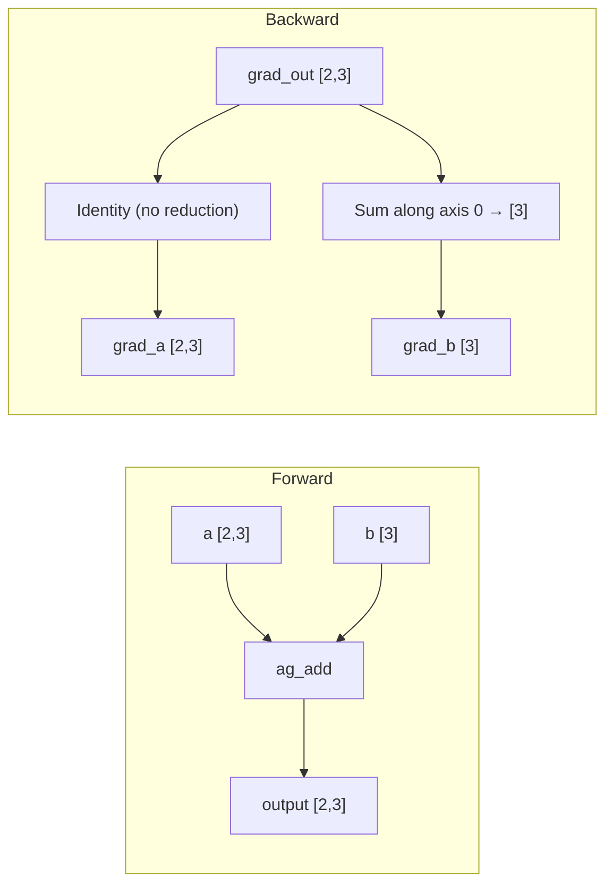
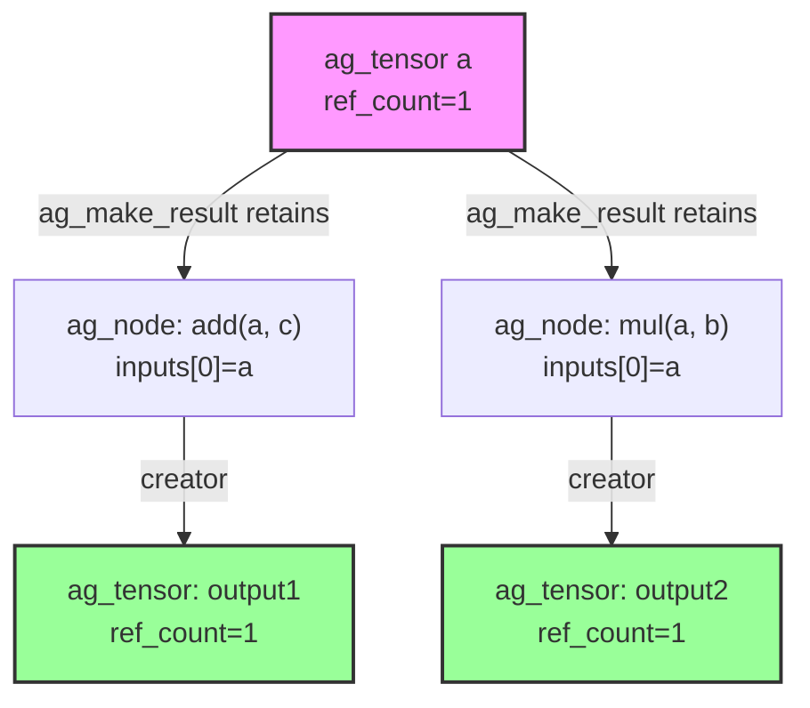

# Autograd Engine

TensorLib's autograd engine provides **dynamic reverse-mode automatic differentiation** over a define-by-run computation graph. Every differentiable operation eagerly executes the forward pass while simultaneously recording a backward node. When `ag_backward` is called on a loss tensor, the engine traverses the recorded graph in reverse topological order, propagating gradients from output to every contributing leaf.

## Table of Contents

1. [Overview](#1-overview)
2. [Core Data Structures](#2-core-data-structures)
3. [Computation Graph Construction](#3-computation-graph-construction)
4. [Tensor Lifecycle in Autograd](#4-tensor-lifecycle-in-autograd)
5. [The 23 Differentiable Operations](#5-the-23-differentiable-operations)
6. [Backward Pass (The Core Algorithm)](#6-backward-pass-the-core-algorithm)
7. [Broadcast Gradient Reduction](#7-broadcast-gradient-reduction)
8. [Error Handling & Graph Consistency](#8-error-handling--graph-consistency)
9. [API Reference](#9-api-reference)
10. [Test Coverage](#10-test-coverage)
11. [Design Decisions & Tradeoffs](#11-design-decisions--tradeoffs)

---

## 1. Overview

TensorLib's autograd system is a from-scratch C99 implementation of the same fundamental idea found in [PyTorch's autograd engine](https://github.com/pytorch/pytorch/blob/main/torch/csrc/autograd/engine.cpp): a **dynamic computation graph** built eagerly during forward execution, traversed in reverse during backward.

### What autograd provides

- **Dynamic reverse-mode AD**: the graph is built on-the-fly as `ag_add`, `ag_matmul`, etc. are called. No separate tracing or compilation step.
- **23 differentiable operations** spanning element-wise arithmetic, activations, reductions, views, matrix multiplication, and gathering.
- **Automatic broadcast-reduction**: when inputs are broadcast during forward, gradients are automatically reduced back to input shape during backward.
- **Gradient accumulation**: repeated calls to `ag_backward` accumulate gradients on leaf tensors, matching PyTorch's behavior.
- **Transactional safety**: if any tensor is modified between forward and backward, the entire backward pass is rejected and existing gradients are left unchanged.
- **Manual reference counting**: deterministic lifetime management with no garbage collector.

### Comparison to PyTorch

| Aspect | TensorLib autograd | [PyTorch autograd](https://github.com/pytorch/pytorch/blob/main/torch/csrc/autograd/engine.cpp) |
|--------|-------------------|------------------------------------------|
| Graph type | Dynamic (define-by-run) | Dynamic (define-by-run) |
| Backward dispatch | Single-threaded reverse topological sort | Multi-threaded task queue with worker threads |
| Node representation | `ag_node` struct with function pointer | [Node/Edge](https://github.com/pytorch/pytorch/blob/main/torch/csrc/autograd/graph_task.h) with `gradient_edge` |
| Stale detection | Storage version counters | Version counters on variables |
| Memory management | Manual reference counting | Shared pointers (`std::shared_ptr`) |
| Gradient accumulation | Transactional merge after traversal | Per-node accumulation with `AccumulateGrad` |

### Comparison to ggml

[ggml](https://github.com/ggerganov/llama.cpp/tree/master/ggml) supports backward passes via `ggml_grad` and `ggml_cgraph`, but builds the entire computation graph statically before execution. TensorLib builds the graph dynamically, which means:

- No separate "build graph" and "execute graph" phases.
- Control flow (loops, conditionals) naturally produces different graph structures on each invocation.
- Memory is freed incrementally via reference counting rather than bulk-freed after graph execution.

---

## 2. Core Data Structures

### `ag_op` enum — all 23 differentiable operations

Defined in `include/tensorlib/autograd.h:27-52`:

```c
typedef enum {
    AG_OP_ADD,           // a + b
    AG_OP_SUB,           // a - b
    AG_OP_MUL,           // a * b
    AG_OP_DIV,           // a / b
    AG_OP_NEG,           // -a
    AG_OP_EXP,           // e^a
    AG_OP_LOG,           // ln(a)
    AG_OP_POW,           // a^exponent
    AG_OP_SQRT,          // sqrt(a)
    AG_OP_RELU,          // max(0, a)
    AG_OP_SIGMOID,       // 1 / (1 + e^-a)
    AG_OP_TANH,          // tanh(a)
    AG_OP_GELU,          // 0.5 * a * (1 + tanh(sqrt(2/pi) * (a + 0.044715*a^3)))
    AG_OP_MATMUL,        // matrix multiply
    AG_OP_SUM,           // sum along dimension
    AG_OP_MEAN,          // mean along dimension
    AG_OP_MAX,           // max along dimension
    AG_OP_RESHAPE,       // reshape (zero-copy view)
    AG_OP_TRANSPOSE,     // transpose (zero-copy view)
    AG_OP_SLICE,         // slice along dimension (zero-copy view)
    AG_OP_EXPAND,        // expand with broadcasting (zero-copy view)
    AG_OP_GATHER_ROWS,   // select rows by index
    AG_OP_MUL_SCALAR,    // tensor * float
    AG_OP_DIV_SCALAR     // tensor / float
} ag_op;
```

### `ag_tensor` — the autograd tensor wrapper

Defined in `include/tensorlib/autograd.h:67-78`:

```c
struct ag_tensor {
    tensor* value;       // the underlying numeric data
    tensor* grad;        // accumulated gradient (NULL until backward)

    int requires_grad;   // 1 = participates in gradient tracking

    ag_node* creator;    // the node that produced this tensor (NULL for leaves)

    int ref_count;       // manual reference count

    int graph_index;     // temporary index used during backward traversal; -1 when idle
};
```

An `ag_tensor` wraps a raw `tensor` (see [tensor_mechanics.md](./tensor_mechanics.md)) and adds gradient tracking. The `creator` pointer forms a linked list from output tensors back to their producing nodes, creating the computation graph.

### `ag_node` — a graph node

Defined in `include/tensorlib/autograd.h:81-101`:

```c
struct ag_node {
    ag_op operation;            // which op created this node

    int input_count;            // number of differentiable inputs (1 or 2)
    ag_tensor** inputs;         // retained input tensors (owned references)

    ag_tensor* output;          // non-owning back-pointer to the result

    ag_backward_fn backward;    // local backward function pointer

    void* context;              // operation-specific saved state (e.g., scalar value, dim)
    void (*free_context)(void*); // destructor for context

    uint64_t* input_versions;   // storage versions at forward time
    uint64_t output_version;    // output storage version at forward time

    int ref_count;              // manual reference count
};
```

### Class Diagram



### Comparison to PyTorch's Node/Edge design

PyTorch uses [`Node`](https://github.com/pytorch/pytorch/blob/main/torch/csrc/autograd/graph_task.h) and `Edge` objects where each edge carries a gradient edge (input index + gradient function). TensorLib simplifies this into a single `ag_node` struct:

- **PyTorch**: `Node` → `Edge` → `Node` (edges carry metadata about which input slot)
- **TensorLib**: `ag_node.inputs[]` directly holds retained `ag_tensor*` pointers; the input index is implicit (array position)

TensorLib also avoids PyTorch's `AccumulateGrad` leaf node pattern. Instead, `ag_backward` handles leaf accumulation directly via `merge_persistent_gradients`.

### Comparison to ggml

ggml uses `ggml_cgraph` (a static graph) containing `ggml_tensor` nodes and `ggml_grad` metadata. The graph is built in a single pass and executed separately. TensorLib's `ag_node` is closer to PyTorch's dynamic approach: each forward op creates and links its node immediately.

---

## 3. Computation Graph Construction

### How the graph is built

Every `ag_*` forward operation follows the same pattern:

1. Execute the raw `t_*` forward operation to produce an output tensor.
2. Call `ag_make_result`, which checks if any input `requires_grad`.
3. If yes, allocate an `ag_node`, record storage versions for stale detection, retain all inputs, and link the node as the output's `creator`.
4. If no input requires gradients, return the result without a creator (untracked leaf).

### Forward operation lifecycle



### Concrete example: `ag_add(a, b)`

From `src/autograd/autograd_ops.c:107-108`:

```c
ag_tensor* ag_add(const ag_tensor* a, const ag_tensor* b) {
    return apply_binary(a, b, AG_OP_ADD, t_add, backward_add);
}
```

The `apply_binary` helper (`autograd_ops.c:96-105`) calls `t_add` for the forward, then delegates to `ag_make_result`:

```c
static ag_tensor* apply_binary(const ag_tensor* a, const ag_tensor* b,
                               ag_op operation, binary_forward_fn forward,
                               ag_backward_fn backward) {
    tensor* output = forward(a->value, b->value);
    ag_tensor* inputs[2] = {(ag_tensor*)a, (ag_tensor*)b};
    return ag_make_result(output, operation, 2, inputs, backward, NULL, NULL);
}
```

### No graph → no overhead

When no input requires gradients, `ag_make_result` returns the result without allocating a node (`autograd_core.c:108-111`):

```c
if (!requires_grad) {
    if (free_context != NULL) free_context(context);
    return result;   // untracked leaf — no creator, no node
}
```

This means mixing tracked and untracked tensors is efficient: only tensors involved in gradient computation pay the graph overhead.

---

## 4. Tensor Lifecycle in Autograd

### Creating autograd tensors

**From a raw tensor** — `ag_from_owned_tensor` (`autograd_core.c:6-23`):

```c
ag_tensor* ag_from_owned_tensor(tensor* value, int requires_grad);
```

Takes ownership of `value`. Returns an `ag_tensor` with `grad = NULL`, `creator = NULL`, `ref_count = 1`, and `graph_index = -1`. The `requires_grad` parameter is normalized: any non-zero value becomes `1`.

**Detaching** — `ag_detach` (`autograd_core.c:25-46`):

Creates a zero-copy leaf alias that shares the same `Storage` but has `requires_grad = 0`, no grad, and no creator. This is useful for stopping gradient flow through a branch while sharing data.

### Creating gradient tensors

`ag_full_like` (`autograd_core.c:153-161`) allocates a new tensor with the same shape as a reference but filled with a constant value. Used internally to create zero-valued gradient buffers for slice and max backward passes.

### Reference counting

Both `ag_tensor` and `ag_node` use manual reference counting:

- **`ag_tensor_retain`** / **`ag_tensor_release`**: increment/decrement the tensor's `ref_count`. When it reaches zero, the creator node is released, `grad` and `value` are freed, and the `ag_tensor` itself is freed.
- **`ag_node_retain`** / **`ag_node_release`**: same pattern for nodes. When a node's refcount reaches zero, it frees its `context`, releases all retained input tensors, and frees itself.

The graph is held alive through reference counting: `ag_make_result` retains each input tensor in the node. The output tensor owns the node through its `creator` pointer. Releasing the output cascades to releasing the node, which cascades to releasing its inputs.

### ag_tensor lifecycle



---

## 5. The 23 Differentiable Operations

Operations are grouped by category. For each operation, the table shows the forward behavior and the backward gradient formula.

### Element-wise Binary

| Operation | Forward | Backward (grad_a, grad_b) |
|-----------|---------|--------------------------|
| `AG_OP_ADD` | `a + b` (broadcast) | `grad_out`, `grad_out` |
| `AG_OP_SUB` | `a - b` (broadcast) | `grad_out`, `-grad_out` |
| `AG_OP_MUL` | `a * b` (broadcast) | `grad_out * b`, `grad_out * a` |
| `AG_OP_DIV` | `a / b` (broadcast) | `grad_out / b`, `-grad_out * a / b²` |

### Scalar Binary

| Operation | Forward | Backward (grad_a) |
|-----------|---------|-------------------|
| `AG_OP_MUL_SCALAR` | `a * scalar` | `grad_out * scalar` |
| `AG_OP_DIV_SCALAR` | `a / scalar` | `grad_out / scalar` |

### Unary

| Operation | Forward | Backward |
|-----------|---------|----------|
| `AG_OP_NEG` | `-a` | `-grad_out` |
| `AG_OP_EXP` | `e^a` | `grad_out * output` (reuses forward output) |
| `AG_OP_LOG` | `ln(a)` | `grad_out / a` |
| `AG_OP_POW` | `a^x` | Special-cased: x=0 → 0, x=1 → grad_out, else `grad_out * x * a^(x-1)` |
| `AG_OP_SQRT` | `√a` | `grad_out / (2 * output)` (reuses forward output) |
| `AG_OP_RELU` | `max(0, a)` | `grad_out` if a>0, `0` if a≤0, `NaN` if a=NaN |
| `AG_OP_SIGMOID` | `1/(1+e^-a)` | `grad_out * output * (1 - output)` |
| `AG_OP_TANH` | `tanh(a)` | `grad_out * (1 - output²)` |
| `AG_OP_GELU` | tanh approximation | `grad_out * d/dx GELU(x)` |

### Reductions

| Operation | Forward | Backward |
|-----------|---------|----------|
| `AG_OP_SUM` | `sum(a, dim)` | Expand upstream to input shape (uniform distribution) |
| `AG_OP_MEAN` | `mean(a, dim)` | Same as sum, but scaled by `1/dim_size` |
| `AG_OP_MAX` | `max(a, dim)` | Upstream distributed equally among tied maxima; 0 elsewhere; NaN input → NaN gradient |

### Views

| Operation | Forward | Backward |
|-----------|---------|----------|
| `AG_OP_RESHAPE` | Zero-copy reshape | `reshape(grad_out, original_shape)` |
| `AG_OP_TRANSPOSE` | Zero-copy transpose | `transpose(grad_out, dim0, dim1)` (inverse) |
| `AG_OP_SLICE` | Zero-copy slice | Scatter upstream back into zero-filled input shape |
| `AG_OP_EXPAND` | Zero-copy expand | Clone upstream (broadcast gradient reduced by `ag_backward` later) |

### Matmul

| Operation | Forward | Backward |
|-----------|---------|----------|
| `AG_OP_MATMUL` | `A @ B` | `grad_out @ B^T`, `A^T @ grad_out` (handles vector/matrix/batched) |

### Gather

| Operation | Forward | Backward |
|-----------|---------|----------|
| `AG_OP_GATHER_ROWS` | Select rows by index | Scatter-add upstream into zero-filled table gradient (supports duplicate indices) |

---

## 6. Backward Pass (The Core Algorithm)

The backward pass is implemented in `src/autograd/autograd_backward.c`.

### Entry points

```c
int ag_backward(ag_tensor* loss);                              // scalar seed = 1.0
int ag_backward_with_grad(ag_tensor* output, const tensor* output_gradient);
```

`ag_backward` requires `loss` to be a scalar (ndim == 0) and seeds with `ag_full_like(loss->value, 1.0f)`. `ag_backward_with_grad` allows non-scalar outputs with a user-supplied upstream gradient.

### Algorithm step by step



### Graph collection: `collect_graph`

The DFS in `collect_graph` (`autograd_backward.c:43-52`) walks from the loss tensor through `creator` links, depth-first:

```c
static int collect_graph(ag_tensor* value, tensor_list* tensors, node_list* nodes) {
    if (value == NULL || value->graph_index >= 0) return value == NULL;
    value->graph_index = tensors->count;
    if (append_tensor(tensors, value) != 0) return 1;
    if (value->creator == NULL) return 0;  // leaf
    for (int i = 0; i < value->creator->input_count; ++i) {
        if (collect_graph(value->creator->inputs[i], tensors, nodes) != 0) return 1;
    }
    return append_node(nodes, value->creator);
}
```

Each tensor gets a `graph_index` (used as an index into `pass_gradients`). Nodes are appended in post-order so that iterating `nodes` from back to front gives reverse topological order.

### The backward loop

From `autograd_backward.c:170-198`:

```c
for (int node_index = nodes.count - 1; node_index >= 0; --node_index) {
    ag_node* node = nodes.values[node_index];
    int gradient_index = node->output->graph_index;

    tensor* contributions[2] = {NULL, NULL};
    node->backward(node, pass_gradients[gradient_index], contributions);

    for (int input_index = 0; input_index < node->input_count; ++input_index) {
        ag_tensor* input = node->inputs[input_index];
        if (!input->requires_grad) { t_free(contributions[input_index]); continue; }
        accumulate_pass_gradient(&pass_gradients[input->graph_index],
                                 contributions[input_index], input->value);
    }
}
```

### Gradient accumulation

`accumulate_pass_gradient` (`autograd_backward.c:103-118`) reduces a contribution to the target shape via `reduce_to_shape`, then adds it to the existing pass gradient for that tensor. If the destination is NULL (first contribution), it stores the reduced contribution directly.

### Merging with persistent gradients

After the backward loop, `merge_persistent_gradients` (`autograd_backward.c:120-145`) combines pass-local gradients with any previously accumulated `.grad` on each `ag_tensor`:

```c
merged[i] = value->grad == NULL
          ? t_clone(pass_gradients[i])
          : t_add(value->grad, pass_gradients[i]);
```

This is what makes repeated `ag_backward` calls accumulate: existing `.grad` values are added to new ones.

### Comparison to PyTorch's `evaluate_function`

PyTorch uses a task queue with worker threads. Each completed node enqueues its dependents. TensorLib uses a simpler single-threaded reverse iteration over the sorted node list. This is correct because the graph is a DAG and the post-order DFS guarantees dependencies are processed first.

PyTorch's `Node::gradient_edge` design returns a single gradient per output; TensorLib's `ag_backward_fn` returns one gradient per input directly, avoiding the need for edge-indexed gradient lookups.

---

## 7. Broadcast Gradient Reduction

This is one of the most critical algorithms in the engine. When an input is broadcast during forward (e.g., adding a `[3]` vector to a `[2, 3]` matrix), the upstream gradient has the output shape, not the input shape. The gradient must be **reduced** back to the input's shape by summing along the broadcast dimensions.

### The algorithm: `reduce_to_shape`

From `autograd_backward.c:74-101`:

```c
static tensor* reduce_to_shape(tensor* contribution, const tensor* target) {
    tensor* current = contribution;

    // Step 1: Reduce extra leading dimensions
    while (current->ndim > target->ndim) {
        tensor* reduced = t_sum(current, 0);
        t_free(current);
        current = reduced;
    }

    // Step 2: For each axis, if target has size 1 but current has size > 1,
    //         sum along that axis (keepdim)
    for (int axis = 0; axis < target->ndim; ++axis) {
        if (current->dims[axis] == target->dims[axis]) continue;
        if (target->dims[axis] != 1 || current->dims[axis] == 1) {
            t_free(current); return NULL;  // shape mismatch
        }
        tensor* reduced = t_sum_keepdim(current, axis);
        t_free(current);
        current = reduced;
    }
    return current;
}
```

### Visual example

Consider `a` with shape `[2, 3]` and `b` with shape `[3]`, computing `ag_add(a, b)`:



For `b`, the gradient `[2,3]` is reduced along axis 0 (where `b` was broadcast from `[3]` to `[2,3]`), summing the two rows to produce `[3]`.

This reduction happens in `accumulate_pass_gradient`, which calls `reduce_to_shape` before accumulating the contribution into the pass gradient.

---

## 8. Error Handling & Graph Consistency

### Stale graph detection

TensorLib uses **storage version counters** to detect when tensors have been modified between forward and backward. Every `Storage` has a monotonically increasing `version` field. When `tensor_mark_modified` is called, the version increments.

During forward, `ag_make_result` captures the version of every input's storage and the output's storage:

```c
node->input_versions[i] = inputs[i]->value->storage->version;
node->output_version = output->storage->version;
```

Before backward executes, `graph_versions_match` (`autograd_backward.c:54-72`) verifies that all captured versions still match:

```c
static int graph_versions_match(const node_list* nodes) {
    for (int node_index = 0; node_index < nodes->count; ++node_index) {
        const ag_node* node = nodes.values[node_index];
        if (node->output->value->storage->version != node->output_version)
            return 0;
        for (int input_index = 0; input_index < node->input_count; ++input_index) {
            if (node->inputs[input_index]->value->storage->version !=
                node->input_versions[input_index])
                return 0;
        }
    }
    return 1;
}
```

If any version mismatches, `ag_backward_with_grad` returns `1` (failure) and **no gradients are modified**.

### Transactional error handling

The backward pass is transactional. `pass_gradients` is a local array; all computation happens there. Only after the entire backward loop succeeds does `merge_persistent_gradients` write to the actual `.grad` fields. If any step fails:

```c
cleanup:
    for (int i = 0; i < tensors.count; ++i) t_free(pass_gradients[i]);
    free(pass_gradients);
    for (int i = 0; i < tensors.count; ++i) tensors.values[i]->graph_index = -1;
    // .grad fields are never touched — existing gradients are preserved
    return status;  // 1 = failure
```

This means a failed backward leaves all `.grad` fields exactly as they were, even if previous backward calls had accumulated gradients.

### When does staleness happen?

Staleness occurs when:

1. A tensor's underlying `Storage` data is modified (via direct write + `tensor_mark_modified`).
2. A view's storage is modified through an alias.
3. The `ag_detach` alias is mutated.

The engine detects this and refuses to compute gradients on a potentially corrupted graph. After a stale rejection, you can call `ag_zero_grad_all` and rebuild the graph if needed.

---

## 9. API Reference

### Tensor Construction & Lifetime

| Function | Signature | Description |
|----------|-----------|-------------|
| `ag_from_owned_tensor` | `ag_tensor* ag_from_owned_tensor(tensor* value, int requires_grad)` | Wraps a raw tensor, taking ownership. Returns NULL on invalid metadata (frees value). |
| `ag_detach` | `ag_tensor* ag_detach(const ag_tensor* value)` | Creates a zero-copy leaf alias with `requires_grad=0`, sharing storage. |
| `ag_tensor_retain` | `void ag_tensor_retain(ag_tensor* value)` | Increments reference count. |
| `ag_tensor_release` | `void ag_tensor_release(ag_tensor* value)` | Decrements reference count; frees when zero. |
| `ag_node_retain` | `void ag_node_retain(ag_node* node)` | Increments node reference count. |
| `ag_node_release` | `void ag_node_release(ag_node* node)` | Decrements node reference count; frees when zero. |

### Binary Operations

| Function | Signature |
|----------|-----------|
| `ag_add` | `ag_tensor* ag_add(const ag_tensor* a, const ag_tensor* b)` |
| `ag_sub` | `ag_tensor* ag_sub(const ag_tensor* a, const ag_tensor* b)` |
| `ag_mul` | `ag_tensor* ag_mul(const ag_tensor* a, const ag_tensor* b)` |
| `ag_div` | `ag_tensor* ag_div(const ag_tensor* a, const ag_tensor* b)` |
| `ag_mul_scalar` | `ag_tensor* ag_mul_scalar(const ag_tensor* value, float scalar)` |
| `ag_div_scalar` | `ag_tensor* ag_div_scalar(const ag_tensor* value, float scalar)` |

### Unary Operations

| Function | Signature |
|----------|-----------|
| `ag_neg` | `ag_tensor* ag_neg(const ag_tensor* value)` |
| `ag_exp` | `ag_tensor* ag_exp(const ag_tensor* value)` |
| `ag_log` | `ag_tensor* ag_log(const ag_tensor* value)` |
| `ag_pow` | `ag_tensor* ag_pow(const ag_tensor* value, float exponent)` |
| `ag_sqrt` | `ag_tensor* ag_sqrt(const ag_tensor* value)` |
| `ag_relu` | `ag_tensor* ag_relu(const ag_tensor* value)` |
| `ag_sigmoid` | `ag_tensor* ag_sigmoid(const ag_tensor* value)` |
| `ag_tanh` | `ag_tensor* ag_tanh(const ag_tensor* value)` |
| `ag_gelu` | `ag_tensor* ag_gelu(const ag_tensor* value)` |

### Reductions

| Function | Signature |
|----------|-----------|
| `ag_sum` | `ag_tensor* ag_sum(const ag_tensor* value, int dim, int keepdim)` |
| `ag_mean` | `ag_tensor* ag_mean(const ag_tensor* value, int dim, int keepdim)` |
| `ag_max` | `ag_tensor* ag_max(const ag_tensor* value, int dim, int keepdim)` |

### Views

| Function | Signature |
|----------|-----------|
| `ag_reshape` | `ag_tensor* ag_reshape(const ag_tensor* value, int new_ndim, const int* new_dims)` |
| `ag_transpose` | `ag_tensor* ag_transpose(const ag_tensor* value, int dim0, int dim1)` |
| `ag_slice` | `ag_tensor* ag_slice(const ag_tensor* value, int dim, int start, int end)` |
| `ag_expand` | `ag_tensor* ag_expand(const ag_tensor* value, int new_ndim, const int* new_dims)` |

### Matmul & Gather

| Function | Signature |
|----------|-----------|
| `ag_matmul` | `ag_tensor* ag_matmul(const ag_tensor* a, const ag_tensor* b)` |
| `ag_gather_rows` | `ag_tensor* ag_gather_rows(const ag_tensor* table, const tensor* indices)` |

Note: `ag_gather_rows` takes a raw `tensor*` for indices, not an `ag_tensor*`. Indices are not differentiable.

### Backward & Gradient Management

| Function | Signature | Description |
|----------|-----------|-------------|
| `ag_backward` | `int ag_backward(ag_tensor* loss)` | Backward from a scalar loss, seeding with 1.0. Returns 0 on success, 1 on failure. |
| `ag_backward_with_grad` | `int ag_backward_with_grad(ag_tensor* output, const tensor* output_gradient)` | Backward with explicit upstream gradient. Output must have `requires_grad=1`. |
| `ag_zero_grad` | `void ag_zero_grad(ag_tensor* value)` | Frees and NULLs a single tensor's `.grad`. |
| `ag_zero_grad_all` | `void ag_zero_grad_all(ag_tensor* root)` | Zeros `.grad` on every tensor reachable from root through the graph. |

All forward operations return `NULL` on invalid arguments (NULL inputs, incompatible shapes, out-of-bounds dimensions, etc.).

---

## 10. Test Coverage

The autograd test suite comprises 9 test files in `tests/unit/autograd/`:

| Test File | Focus | Key Patterns |
|-----------|-------|-------------|
| `test_autograd_core.c` | `ag_tensor` construction, `ag_detach`, retain/release lifecycle | Verifies ref counting, detached aliases sharing storage, null safety |
| `test_autograd_ops.c` | Binary ops (add/sub/mul/div), unary ops (neg/exp/log/pow/sqrt/relu/sigmoid/tanh/gelu), scalar ops | Local backward gradient checks, finite-difference verification, broadcast forward/backward, IEEE edge cases (NaN, Inf) |
| `test_autograd_view.c` | Reshape, transpose, slice, expand | Local backward shape verification, gradient scatter/gather correctness |
| `test_autograd_reduc.c` | Sum, mean, max reductions | Expand-backward for sum/mean, tie-splitting for max, NaN propagation |
| `test_autograd_matmul.c` | Matrix-matrix, vector-vector, vector-matrix, matrix-vector, batched matmul | Local backward checks, finite-difference validation, view-based matmul |
| `test_autograd_gather.c` | `ag_gather_rows` forward and backward | Scatter-add with duplicate indices, invalid index rejection |
| `test_autograd_backward.c` | Full backward pass through composed graphs | Chain gradients, shared DAG accumulation, unbroadcast verification, seeded backward, repeated accumulation, stale graph rejection, zero_grad |
| `test_autograd_integration.c` | End-to-end gradient correctness | Central-difference finite-difference verification for composed graphs (mul→exp→log→sum→mean), view chains, expand chains, lifecycle stress tests (500 iterations, MSVC debug heap leak detection) |
| `test_autograd_public_contract.c` | Comprehensive public API contract | Node ownership, graph omission for untracked tensors, broadcasting, local backward ownership, view gradients, reductions, matmul, accumulation, seed validation, stale graph rejection, null/invalid argument handling |

### Key testing patterns

**Finite-difference gradient checking**: The integration and ops tests compute numerical gradients via central differences `(f(x+ε) - f(x-ε)) / 2ε` and compare against autograd's analytical gradients, typically within `1e-3` to `1e-5` tolerance.

**Transactionality testing**: Tests verify that modifying a tensor after forward causes `ag_backward` to return 1 and leaves existing gradients unchanged.

**Memory leak detection**: On MSVC debug builds, `_CrtMemCheckpoint` / `_CrtMemDifference` verify zero leaked bytes after 500-iteration stress tests.

---

## 11. Design Decisions & Tradeoffs

### Dynamic graph (like PyTorch) vs static graph (like TensorFlow 1.x)

TensorLib uses a **dynamic (define-by-run) graph**, matching PyTorch's approach. This means:

- **Pros**: Natural control flow, simpler debugging (standard C debugger works), no session/graph compilation overhead, incremental memory management.
- **Cons**: No graph-level optimization (common subexpression elimination, operator fusion), no automatic batching across iterations.

A static graph approach (like TensorFlow 1.x or ggml's `ggml_cgraph`) would enable graph optimizations but would require separating graph construction from execution, making the C API significantly more complex.

### Manual reference counting vs garbage collection

TensorLib uses **manual reference counting** with explicit `retain`/`release` calls. This is the natural choice for a C99 library:

- **Pros**: Deterministic deallocation, no GC pauses, simple implementation, portable across all C99 compilers.
- **Cons**: Users must carefully release tensors; cycles would leak (though the DAG structure of autograd graphs prevents reference cycles in practice).

The reference count on `ag_tensor` ensures that tensors shared between multiple consumers (e.g., an input used by two different operations) are kept alive until all consumers release them.

### Ownership and reference count flow

When a tensor is used as input to two operations, both nodes retain it:



Releasing `output1` decrements `a`'s refcount from 3 to 2 (the `add` node releases its retained `a`). Releasing `output2` decrements it to 1. Only when the user finally releases the original `a` does its refcount reach 0 and its storage is freed.

### Storage version counters vs PyTorch's version counter

Both TensorLib and PyTorch use monotonically increasing version counters on storage to detect mutations. The mechanism is essentially identical:

- TensorLib: `Storage.version` incremented by `tensor_mark_modified`.
- PyTorch: Variable version counter incremented on in-place modification.

TensorLib checks versions for **both inputs and outputs** at every node, while PyTorch primarily checks input versions. This provides comprehensive staleness detection including cases where an intermediate output is modified.

### Why 23 operations specifically?

The 23 operations represent the **minimal set** needed for common deep learning workloads:

- **4 binary arithmetic** (add, sub, mul, div) + 2 scalar variants
- **8 unary** (neg, exp, log, pow, sqrt, relu, sigmoid, tanh, gelu) — covers all standard activation functions
- **1 matmul** — the core linear algebra primitive
- **3 reductions** (sum, mean, max) — covers loss computation and normalization
- **4 views** (reshape, transpose, slice, expand) — covers tensor manipulation
- **1 gather** (gather_rows) — covers embedding lookups

This set can express fully-connected layers, convolution (via im2col + matmul), attention mechanisms, layer normalization, and all standard loss functions. Operations like softmax can be composed from exp, sum, and div. See [neural_network_modules.md](./neural_network_modules.md) for how the NN layer uses autograd to build training loops.

### Why `ag_make_result` as the single graph-construction point

Every forward operation funnels through `ag_make_result`, which centralizes:

1. Checking if any input requires gradients.
2. Allocating the node and result tensor.
3. Recording storage versions.
4. Retaining inputs.
5. Handling allocation failures transactionally.

This eliminates duplicated graph-construction logic across 23 operations and ensures consistent error handling.

---

## Source File Layout

| File | Purpose |
|------|---------|
| `include/tensorlib/autograd.h` | Public API: `ag_tensor`, `ag_node`, all `ag_*` functions |
| `include/tensorlib/autograd_internal.h` | Internal helpers: `ag_make_result`, `ag_full_like` |
| `src/autograd/autograd_core.c` | Construction, lifetime, detach, `ag_make_result` |
| `src/autograd/autograd_ops.c` | Binary ops (add/sub/mul/div), scalar ops, unary ops (neg/exp/log/pow/sqrt/relu/sigmoid/tanh/gelu) |
| `src/autograd/autograd_view.c` | View ops (reshape, transpose, slice, expand) |
| `src/autograd/autograd_reduc.c` | Reduction ops (sum, mean, max) |
| `src/autograd/autograd_matmul.c` | Matrix multiplication with vector/batch support |
| `src/autograd/autograd_gather.c` | `gather_rows` with scatter-add backward |
| `src/autograd/autograd_backward.c` | Backward pass: graph collection, version check, traversal, accumulation |
