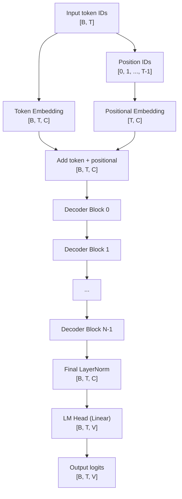
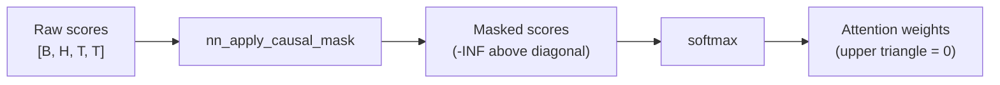
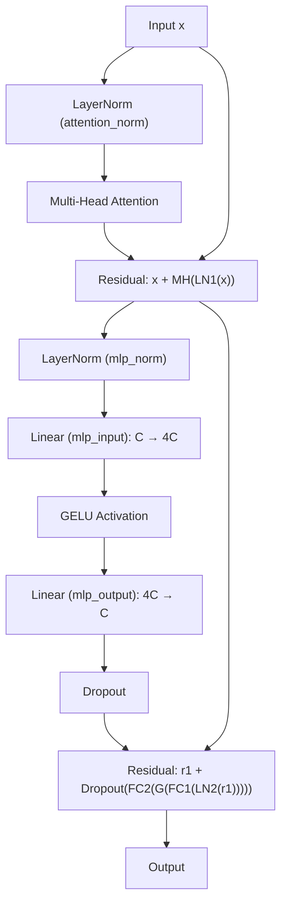
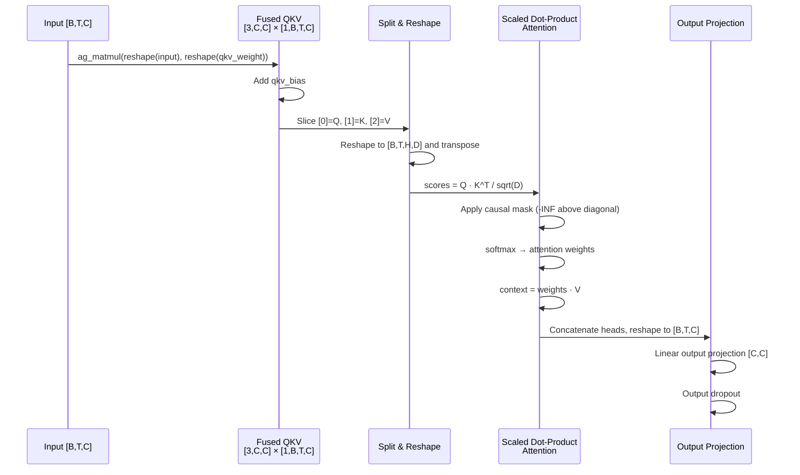
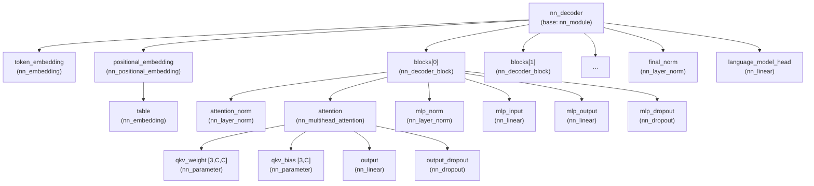
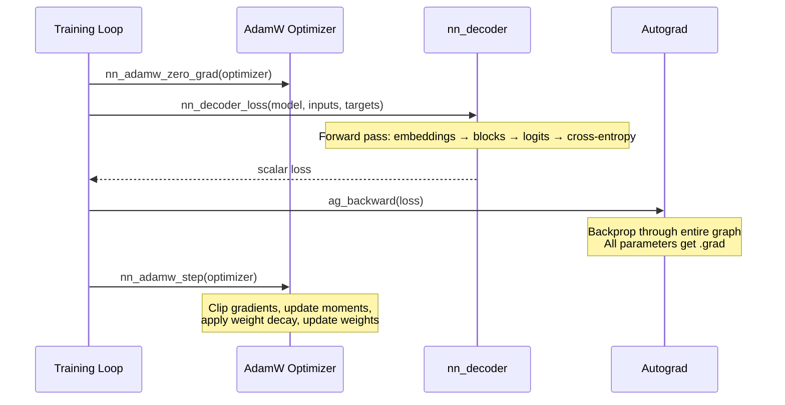

# Decoder Implementation

TensorLib's decoder is a complete, from-scratch implementation of a GPT-style
causal transformer decoder in C99. It composes token embeddings, positional
embeddings, configurable-depth pre-norm residual blocks with multi-head causal
self-attention, a final layer normalization, and a language-model projection
head into a single module that maps token IDs to next-token logits.

The decoder is the highest-level building block in TensorLib's neural network
stack. It depends on the autograd engine for automatic differentiation, the
tensor library for storage and shape manipulation, and the individual neural
network primitives (linear, embedding, layer norm, attention, dropout) for its
internal layers. See [autograd_engine.md](./autograd_engine.md) for how
gradients flow through the computation graph, and
[tensor_mechanics.md](./tensor_mechanics.md) for tensor allocation and layout
details.

## 1. Overview

TensorLib's `nn_decoder` implements a GPT-2-style transformer decoder suitable
for autoregressive language modeling. The design is intentionally close to
[karpathy/nanoGPT](https://github.com/karpathy/nanoGPT) and
[PyTorch's TransformerDecoder](https://github.com/pytorch/pytorch/blob/main/torch/nn/modules/transformer.py),
but written entirely in portable C99 with no external dependencies beyond the
standard library.

Key characteristics:

- **Configurable depth, width, and head count** via a single `nn_decoder_config`
  struct.
- **Pre-norm residual blocks** (LayerNorm before attention and MLP) matching
  GPT-2's design for stable deep training.
- **Fused QKV projection** in multi-head attention for better cache locality.
- **Learned positional embeddings** (not sinusoidal or rotary).
- **Causal masking** via additive lower-triangular mask with `-INFINITY` before
  softmax.
- **Automatic differentiation** through the entire forward pass, enabling
  `ag_backward` to populate gradients for every trainable parameter.
- **Checkpoint save/load** for model parameters, optimizer state, and RNG state.

The decoder is used as the sole model in the
[TinyLM example](../examples/tiny_lm/README.md), which trains a ~1.9M
parameter byte-level language model on Shakespeare text.

## 2. Architecture Overview

The full decoder stack processes integer token IDs shaped `[batch, sequence]`
and produces logits shaped `[batch, sequence, vocabulary_size]`:



Where:
- **B** = batch size
- **T** = sequence length (must be ≤ `context_length`)
- **C** = `channels` (model dimension, `d_model`)
- **V** = `vocabulary_size`
- **N** = `layer_count` (number of decoder blocks)
- **H** = `head_count` (number of attention heads)
- **D** = `channels / head_count` (per-head dimension)

The decoder maps cleanly to GPT-2's architecture choices. GPT-2 Small uses
`n_layer=12, n_head=12, n_embd=768`; TensorLib's TinyLM uses
`layer_count=4, head_count=6, channels=192`. The only GPT-2 design elements
not present are weight-tying (embedding and LM head share weights) and a
separate key-value cache for efficient autoregressive inference.

The `nn_decoder_config` struct encodes all hyperparameters:

```c
struct nn_decoder_config {
    int vocabulary_size;
    int context_length;
    int channels;
    int head_count;
    int layer_count;
    float dropout_probability;
    float layer_norm_epsilon;
};
```

Validation in `decoder_config_valid` ensures `channels % head_count == 0`,
all counts are positive, dropout is in `[0, 1)`, and epsilon is finite and
positive.

## 3. Causal Mask

Autoregressive generation requires that each token position can only attend to
itself and earlier positions. TensorLib enforces this with an additive
lower-triangular mask applied to the raw attention scores before softmax.

### Implementation

The mask is constructed in `causal_mask.c` (`src/nn/causal_mask.c:5-36`):

```c
ag_tensor* nn_apply_causal_mask(const ag_tensor* scores)
{
    int sequence = scores->value->dims[scores->value->ndim - 1];
    int dims[2] = { sequence, sequence };
    tensor* mask_value = t_alloc(2, dims);
    for (int row = 0; row < sequence; ++row) {
        for (int column = 0; column < sequence; ++column) {
            mask_value->storage->data[row * sequence + column] =
                column <= row ? 0.0f : -INFINITY;
        }
    }
    ag_tensor* mask = ag_from_owned_tensor(mask_value, 0);
    ag_tensor* result = ag_add(scores, mask);
    ag_tensor_release(mask);
    return result;
}
```

For a sequence length of 5, the mask matrix looks like:

```
 0.0   0.0   0.0   0.0   0.0
 0.0   0.0   0.0   0.0   0.0
 0.0   0.0   0.0   0.0   0.0
 0.0   0.0   0.0   0.0   0.0
 0.0   0.0   0.0   0.0   0.0
```

Wait — that's the allowed positions. The *mask* that gets **added** is:

```
 0.0    0.0    0.0    0.0    0.0
 0.0    0.0    0.0    0.0    0.0
 0.0    0.0    0.0    0.0    0.0
 0.0    0.0    0.0    0.0    0.0
 0.0    0.0    0.0    0.0    0.0
```

The **mask** itself has `0.0` on and below the diagonal, and `-INFINITY` above:

```
 0.0      -INF     -INF     -INF     -INF
 0.0      0.0      -INF     -INF     -INF
 0.0      0.0      0.0      -INF     -INF
 0.0      0.0      0.0      0.0      -INF
 0.0      0.0      0.0      0.0      0.0
```

After `scores + mask`, every position above the diagonal becomes `-INFINITY`.
After softmax, these positions become `0.0` probability, preventing information
leakage from future tokens.



### Comparison to PyTorch

PyTorch provides `torch.nn.Transformer.generate_square_subsequent_mask(sz)`
which returns the same lower-triangular structure but uses `-inf` as the
masked value. TensorLib's implementation is equivalent: it uses C's
`-INFINITY` from `<math.h>` and applies the mask additively rather than
using `masked_fill_`. The effect is identical — `softmax(score + (-inf)) = 0`.

## 4. Decoder Block (Pre-Norm Residual)

Each decoder block implements the pre-norm residual architecture used by GPT-2
and adopted by most modern transformers. The block contains two sub-layers
(attention and MLP), each preceded by a LayerNorm and wrapped in a skip
connection.

### Forward Pass

The forward pass in `decoder_block.c` (`src/nn/decoder_block.c:162-215`):



In code:

```c
// Pre-norm attention sub-layer
normalized_attention = nn_layer_norm_forward(block->attention_norm, input);
attention_output = nn_multihead_attention_forward(block->attention, normalized_attention);
attention_residual = ag_add(input, attention_output);

// Pre-norm MLP sub-layer
normalized_mlp = nn_layer_norm_forward(block->mlp_norm, attention_residual);
hidden = nn_linear_forward(block->mlp_input, normalized_mlp);      // C → 4C
activated = ag_gelu(hidden);
projected = nn_linear_forward(block->mlp_output, activated);        // 4C → C
dropped = nn_dropout_forward(block->mlp_dropout, projected);
result = ag_add(attention_residual, dropped);
```

### Why Pre-Norm?

Pre-norm places the LayerNorm *before* the sub-layer computation rather than
after. This is the design choice made by GPT-2 (see the original
[Radford et al., 2019](https://cdn.openai.com/better-language-models/language_models_are_unsupervised_multitask_learners.pdf))
and differs from the original Transformer's post-norm.

The key advantage is **training stability**: gradients flow through the
residual connection unimpeded by the normalization layer, which prevents
gradient magnitude from degrading in deep networks. In post-norm, the
LayerNorm sits directly in the gradient path, which can cause training
instability requiring careful learning rate warmup. Pre-norm generally
eliminates this requirement.

### Comparison to PyTorch

PyTorch's `TransformerEncoderLayer` defaults to post-norm in older versions
but offers `norm_first=True` (added in PyTorch 1.11) for pre-norm. TensorLib
uses pre-norm unconditionally, matching the GPT-2 convention.

### Sub-components

Each block registers 6 child modules:

| Child | Type | Description |
|-------|------|-------------|
| `attention_norm` | `nn_layer_norm` | Pre-attention normalization |
| `attention` | `nn_multihead_attention` | Causal self-attention |
| `mlp_norm` | `nn_layer_norm` | Pre-MLP normalization |
| `mlp_input` | `nn_linear` | FFN expansion layer (`C → 4C`) |
| `mlp_output` | `nn_linear` | FFN contraction layer (`4C → C`) |
| `mlp_dropout` | `nn_dropout` | Dropout after FFN output |

The hidden width is always `channels * 4`, matching the standard transformer
ratio from the original "Attention Is All You Need" paper and GPT-2.

## 5. Multi-Head Attention (Deep Dive)

Multi-head attention is the core mechanism that allows the decoder to attend to
all previous token positions in parallel. TensorLib implements causal
self-attention with a fused QKV projection for computational efficiency.

### Fused QKV Projection

Rather than maintaining three separate weight matrices `W_Q`, `W_K`, `W_V`,
TensorLib uses a single fused parameter of shape `[3, C, C]` and a fused bias
of shape `[3, C]`. This reduces the number of memory allocations and improves
cache locality during the projection.



### Forward Pass

The attention forward pass in `multihead_attention.c`
(`src/nn/multihead_attention.c:227-309`):

1. **Fused QKV projection**: Reshape input to `[1, B, T, C]`, matmul with
   weight `[3, 1, C, C]`, add bias `[3, 1, 1, C]`, producing QKV of shape
   `[3, B, T, C]`.

2. **Split into heads**: Slice Q, K, V along the first dimension, reshape each
   to `[B, T, H, D]`, then transpose to `[B, H, T, D]` for batched attention.

3. **Scaled dot-product**: `scores = Q · K^T / sqrt(D)` produces
   `[B, H, T, T]`.

4. **Causal mask**: `nn_apply_causal_mask` adds the lower-triangular mask,
   setting future positions to `-INFINITY`.

5. **Softmax**: `nn_softmax` converts masked scores to attention weights.

6. **Context**: `context = weights · V` produces `[B, H, T, D]`.

7. **Merge heads**: Transpose back to `[B, T, H, D]`, reshape to `[B, T, C]`.

8. **Output projection**: Linear `[C, C]` followed by dropout.

The scaling factor `1/sqrt(D)` prevents the dot-product magnitude from growing
with head dimension, which would push softmax into regions with tiny gradients.

### Comparison to FlashAttention and ggml

TensorLib implements the standard attention algorithm. For comparison:

| Implementation | Approach | Key Difference |
|---|---|---|
| TensorLib | Standard matmul + softmax | Reference implementation, full autograd support |
| [FlashAttention](https://github.com/Dao-AILab/flash-attention) (Dao et al.) | Tiling + online softmax | IO-aware, avoids materializing full `[B,H,T,T]` matrix |
| [ggml](https://github.com/ggerganov/llama.cpp) `ggml_flash_attn` | Fused kernel | CPU/GPU fused kernel, no autograd |
| [PyTorch](https://github.com/pytorch/pytorch/blob/main/torch/nn/functional.py) `scaled_dot_product_attention` | Dispatches to Flash/MEMORY backend | Automatic backend selection |

TensorLib's attention is designed for **correctness and clarity** first. It
materializes the full score matrix, making autograd straightforward. For
production inference, FlashAttention or ggml kernels would be more memory-
and compute-efficient.

### QKV Weight Initialization

The fused QKV weight is initialized with uniform samples from
`[-sqrt(3/C), sqrt(3/C)]` (a form of LeCun/Xavier uniform), and the bias is
initialized to zero. This is done with a manual loop in
`nn_multihead_attention_create` after the parameter is created with
`NN_INIT_ZERO`:

```c
scale = sqrtf(3.0f / (float)channels);
for (int index = 0;
     index < tensor_numel(attention->qkv_weight->value->value);
     ++index) {
    attention->qkv_weight->value->value->storage->data[index] =
        nn_rng_uniform(rng, -scale, scale);
}
```

## 6. MLP Block

Each decoder block contains a two-layer feedforward network (MLP) following the
attention sub-layer. The MLP is an in-place transformation of each token
position independently.

### Architecture

```
Input [B, T, C]
    → Linear [C, 4C]     (mlp_input)
    → GELU activation
    → Linear [4C, C]     (mlp_output)
    → Dropout
Output [B, T, C]
```

The hidden dimension `4C` (stored as `hidden_width = channels * 4` in
`decoder_block.c:54`) follows the standard 4x expansion ratio from the original
Transformer paper. This ratio appears in GPT-2, GPT-3, and virtually all
decoder-only transformers.

### GELU Activation

TensorLib uses the Gaussian Error Linear Unit (GELU) activation, computed via
`ag_gelu` in the autograd graph. GELU is the standard activation in GPT-2 and
most modern transformers, chosen for its smooth gradient properties compared
to ReLU.

### Comparison to Transformer FFN Design

The standard transformer FFN is defined as:

```
FFN(x) = W_out · activation(W_in · x + b_in) + b_out
```

TensorLib's implementation matches this exactly, with bias terms enabled in
both linear layers. The only omission relative to GPT-2 is that the output
projection in some GPT-2 implementations omits bias on the second linear
layer — TensorLib always includes it.

See [neural_network_modules.md](./neural_network_modules.md) for details on
the `nn_linear` and activation function primitives.

## 7. Token & Positional Embeddings

### Token Embedding

The token embedding maps integer token IDs (represented as floats in the
autograd tensor) to dense vectors of dimension `channels`. It is a standard
lookup table:

```c
// embedding.c:86-94
ag_tensor* nn_embedding_forward(const nn_embedding* layer,
                                const ag_tensor* indices) {
    return ag_gather_rows(layer->weight->value, indices->value);
}
```

The weight matrix has shape `[vocabulary_size, channels]` and is initialized
with Xavier uniform. Token IDs must be non-negative integers less than
`vocabulary_size`, stored as float values in the input tensor.

The embedding layer does not require gradients on the input (token IDs are
indices, not differentiable values), but the weight matrix is a trainable
parameter.

### Positional Embedding

Position information is added via a learned positional embedding table. The
positional embedding stores a `[context_length, channels]` weight matrix
(essentially an `nn_embedding` with `vocabulary_size = context_length`).

During forward (`positional_embedding.c:84-118`):

1. Generate position IDs `[0, 1, 2, ..., T-1]` as a float tensor.
2. Look up the corresponding rows from the positional table: `[T, C]`.
3. **Add** the positional vectors to the token embeddings element-wise.

```c
// Generate position IDs
position_values = t_alloc(1, position_dims);
for (int position = 0; position < sequence; ++position) {
    position_values->storage->data[position] = (float)position;
}
position_ids = ag_from_owned_tensor(position_values, 0);
positions = nn_embedding_forward(layer->table, position_ids);
result = ag_add(token_embeddings, positions);
```

### Combination

Token and positional embeddings are combined by **addition** (not
concatenation), producing `[B, T, C]`. This matches the original Transformer
and GPT-2 convention. The learned positional approach is identical to GPT-2
— sinusoidal positional encodings from the original paper are not used.

## 8. Full Decoder Assembly

### The `nn_decoder` Struct

```c
struct nn_decoder {
    nn_module base;

    nn_embedding* token_embedding;
    nn_positional_embedding* positional_embedding;
    nn_decoder_block** blocks;
    size_t block_count;
    nn_layer_norm* final_norm;
    nn_linear* language_model_head;

    nn_decoder_config config;
};
```

### Module Tree

The decoder registers all sub-modules as children of its `nn_module` base,
forming a tree that enables recursive operations like `nn_module_set_training`,
`nn_module_zero_grad`, and parameter counting.



### Forward Pass

`nn_decoder_forward` (`src/nn/decoder.c:213-256`) orchestrates the full
pipeline:

```c
ag_tensor* nn_decoder_forward(const nn_decoder* decoder,
                              const ag_tensor* token_ids) {
    tokens = nn_embedding_forward(decoder->token_embedding, token_ids);
    current = nn_positional_embedding_forward(
        decoder->positional_embedding, tokens);
    for (size_t index = 0; index < decoder->block_count; ++index) {
        next = nn_decoder_block_forward(decoder->blocks[index], current);
        ag_tensor_release(current);
        current = next;
    }
    normalized = nn_layer_norm_forward(decoder->final_norm, current);
    result = nn_linear_forward(decoder->language_model_head, normalized);
    return result;
}
```

The final LayerNorm + linear head is equivalent to GPT-2's approach. GPT-2
optionally ties the LM head weights with the token embedding weights (weight
tying); TensorLib does **not** tie weights, treating the LM head as an
independent linear projection.

### Loss Computation

`nn_decoder_loss` (`src/nn/decoder.c:258-295`) combines forward pass with
cross-entropy loss for convenient training:

```c
ag_tensor* nn_decoder_loss(const nn_decoder* decoder,
                           const ag_tensor* token_ids,
                           const tensor* targets) {
    logits = nn_decoder_forward(decoder, token_ids);
    flattened_logits = ag_reshape(logits, 2, logit_dims);
    flattened_targets = t_reshape(targets, 1, target_dims);
    loss = nn_cross_entropy(flattened_logits, flattened_targets);
    return loss;
}
```

Both `token_ids` and `targets` have shape `[B, T]`. The targets are
shifted-by-one: for input `[t0, t1, t2, ...]`, targets are
`[t1, t2, t3, ...]`. The loss function handles flattening to `[B*T, V]`
and `[B*T]` internally, computes log-softmax, selects the log-probability of
the correct class, negates, and averages.

### Parameter Count Formula

For a decoder with vocabulary size `V`, channels `C`, head count `H`, and
`N` layers:

| Component | Parameters |
|-----------|-----------|
| Token embedding | `V × C` |
| Positional embedding | `L_ctx × C` (where `L_ctx` = context length) |
| Per decoder block: | |
| — attention_norm | `2C` (weight + bias) |
| — QKV weight | `3 × C × C` |
| — QKV bias | `3 × C` |
| — attention output | `C × C + C` |
| — mlp_norm | `2C` |
| — mlp_input | `C × 4C + 4C` |
| — mlp_output | `4C × C + C` |
| Block subtotal | `N × (18C² + 12C)` |
| Final norm | `2C` |
| LM head | `C × V + V` |
| **Total** | `V × C + L_ctx × C + N × (18C² + 12C) + 2C + C × V + V` |

For the test configuration (`V=5, C=8, H=2, N=2, L_ctx=4`):
- Token embedding: 5 × 8 = 40
- Positional embedding: 4 × 8 = 32
- 2 blocks × (18×64 + 12×8) = 2 × 1248 = 2496 → wait, this includes
  per-head splitting that doesn't add parameters. The actual count is
  verified by the unit test as **30 parameter tensors** (not elements —
  parameter count is the number of `nn_parameter` objects, not total floats).

## 9. Training the Decoder

### Loss Function

The decoder uses cross-entropy loss for next-token prediction. The loss is
computed over all positions simultaneously — for each position `t`, the model
predicts the token at position `t+1`. The cross-entropy implementation
(`src/losses/classification.c:84-141`) computes:

1. Numerically stable log-softmax over the vocabulary dimension.
2. Selection of the log-probability corresponding to the target class.
3. Negation to get per-position loss.
4. Mean reduction to scalar.

### Optimizer: AdamW

Training uses AdamW with gradient clipping, implemented in
`src/optim/adamw.c`. Key configuration:

| Hyperparameter | Typical Value | Description |
|---|---|---|
| `learning_rate` | `3e-4` | Step size |
| `beta1` | `0.9` | First moment decay |
| `beta2` | `0.999` | Second moment decay |
| `epsilon` | `1e-8` | Numerical stability |
| `weight_decay` | `0.01` | L2 regularization |
| `max_grad_norm` | `1.0` | Gradient clipping threshold |

The AdamW step (`src/optim/adamw.c:211-275`) applies bias correction and
decoupled weight decay. Gradient clipping computes the global L2 norm across
all parameters and rescales gradients if the norm exceeds `max_grad_norm`.

### Training Loop



From the TinyLM example (`examples/tiny_lm/tiny_lm.c:530-589`):

```c
for (int step = 1; step <= options.steps; ++step) {
    nn_adamw_zero_grad(optimizer);
    make_batch(&corpus, 1, options.batch_size, step, &rng, &inputs, &targets);
    loss = nn_decoder_loss(model, inputs, targets);
    ag_backward(loss);
    nn_adamw_step(optimizer);
    ag_tensor_release(loss);
}
```

See [autograd_engine.md](./autograd_engine.md) for details on how
`ag_backward` traverses the computation graph and accumulates gradients.

### Checkpointing

The training loop periodically saves checkpoints containing model parameters,
AdamW first/second moments, step counts, and RNG state:

```c
nn_checkpoint_save(options.checkpoint_path, &model->base, optimizer, &rng);
```

Checkpoints can be resumed with `--resume`, restoring all training state
transactionally — if validation fails, existing state is left intact.

## 10. Inference / Text Generation

### Autoregressive Generation

The decoder generates text one token at a time. For each new token:

1. Encode the current context as a `[1, T]` tensor of float token IDs.
2. Run `nn_decoder_forward` to get logits `[1, T, V]`.
3. Extract the logits for the **last position** only: `logits[0, T-1, :]`.
4. Sample from the distribution (top-k with temperature, or greedy).
5. Append the sampled token to the context buffer.
6. If the context exceeds `context_length`, shift the window left.

The TinyLM example implements this in `generate()` (`examples/tiny_lm/tiny_lm.c:404-467`):

```c
for (int generated = 0; generated < options.generate_count; ++generated) {
    tensor* raw = t_alloc(2, dims);
    for (size_t index = 0; index < context_size; ++index) {
        raw->storage->data[index] = (float)context[index];
    }
    input = ag_from_owned_tensor(raw, 0);
    logits = nn_decoder_forward(model, input);
    next = sample_next(logits, context_size, temperature, top_k, &rng);
    fputc(next, stdout);
    // Shift context window
    if (context_size < TINY_LM_CONTEXT) {
        context[context_size++] = (unsigned char)next;
    } else {
        memmove(context, context + 1, TINY_LM_CONTEXT - 1);
        context[TINY_LM_CONTEXT - 1] = (unsigned char)next;
    }
}
```

### Top-K Sampling

The `sample_next` function performs top-k sampling:

1. Sort all vocabulary logits by descending score.
2. Select the top `k` candidates.
3. Divide by temperature to sharpen or flatten the distribution.
4. Compute softmax weights for the top-k candidates.
5. Sample from the resulting categorical distribution.

When `temperature = 0`, greedy decoding (argmax) is used. When `top_k = 0`,
the full vocabulary is considered.

### KV-Caching

TensorLib does **not** implement KV-caching. Each generation step recomputes
the full forward pass over the entire context window. This is correct but
computationally expensive for long sequences, since the cost per generated
token is `O(T²)` for attention.

A KV-cache would store the projected keys and values from previous positions,
reducing per-step cost to `O(T)` for the attention layer. This is a common
optimization in production inference engines (e.g., vLLM, llama.cpp, TGI) but
adds significant implementation complexity to the attention module.

## 11. Example: TinyLM

The TinyLM example (`examples/tiny_lm/tiny_lm.c`) is a complete, end-to-end
byte-level language model trainer and text generator.

### Architecture

```c
enum {
    TINY_LM_VOCABULARY = 256,   // Byte-level vocabulary
    TINY_LM_CONTEXT    = 128,   // Maximum sequence length
    TINY_LM_CHANNELS   = 192,   // Model dimension
    TINY_LM_HEADS      = 6,     // Attention heads
    TINY_LM_LAYERS     = 4      // Decoder blocks
};
```

With these dimensions, TinyLM has approximately **1.9 million** trainable
parameters. The head width is `192 / 6 = 32` dimensions per head.

### Training on Shakespeare

The model trains on raw bytes (no tokenizer needed). The corpus is split
90/10 for training and validation. Key training settings:

- Batch size: 1 (configurable)
- Learning rate: `3e-4`
- Weight decay: `0.01`
- Gradient clipping: `max_norm = 1.0`
- Dropout: `0.1`
- Optimizer: AdamW

### Performance

On an i5-13400F in Release mode:
- **~0.66 seconds** per batch-1 update
- **~193 byte tokens/second**
- 1,000 updates ≈ 11 minutes
- 50,000 updates ≈ 9 hours

See [examples/tiny_lm/README.md](../examples/tiny_lm/README.md) for corpus
guidance, build instructions, and configuration options.

## 12. API Reference

### Decoder

```c
nn_decoder* nn_decoder_create(
    const char* name,
    const nn_decoder_config* config,
    nn_rng* rng
);

void nn_decoder_destroy(nn_decoder* decoder);

ag_tensor* nn_decoder_forward(
    const nn_decoder* decoder,
    const ag_tensor* token_ids
);

ag_tensor* nn_decoder_loss(
    const nn_decoder* decoder,
    const ag_tensor* token_ids,
    const tensor* targets
);
```

- `nn_decoder_create` — Allocates the decoder and all sub-modules. Returns
  `NULL` on invalid config, OOM, or if `rng` is `NULL`.
- `nn_decoder_forward` — Maps `[B, T]` token IDs to `[B, T, V]` logits.
  Token IDs must not require gradients. Sequence length must be ≤
  `context_length`.
- `nn_decoder_loss` — Forward pass followed by cross-entropy loss over all
  positions. Returns a scalar `ag_tensor` suitable for `ag_backward`.
- `nn_decoder_destroy` — Recursively frees all sub-modules and parameters.

### Decoder Block

```c
nn_decoder_block* nn_decoder_block_create(
    const char* name,
    int channels,
    int head_count,
    float dropout_probability,
    float layer_norm_epsilon,
    nn_rng* rng
);

void nn_decoder_block_destroy(nn_decoder_block* block);

ag_tensor* nn_decoder_block_forward(
    const nn_decoder_block* block,
    const ag_tensor* input
);
```

Input must be `[B, T, C]`. Output has the same shape.

### Multi-Head Attention

```c
nn_multihead_attention* nn_multihead_attention_create(
    const char* name,
    int channels,
    int head_count,
    float dropout_probability,
    nn_rng* rng
);

void nn_multihead_attention_destroy(nn_multihead_attention* attention);

ag_tensor* nn_multihead_attention_forward(
    const nn_multihead_attention* attention,
    const ag_tensor* input
);
```

Input must be `[B, T, C]` where `C` equals `channels`. Causal masking is
applied automatically.

### Causal Mask

```c
ag_tensor* nn_apply_causal_mask(const ag_tensor* scores);
```

Applies a lower-triangular additive mask to the last two dimensions of
`scores` (which must be square). Entries above the diagonal are set to
`-INFINITY`.

### Module Utilities

```c
size_t nn_module_parameter_count(const nn_module* module);
nn_parameter* nn_module_parameter_at(const nn_module* module, size_t index);
void nn_module_set_training(nn_module* module, int training);
int nn_module_is_training(const nn_module* module);
void nn_module_zero_grad(nn_module* module);
int nn_clip_grad_norm(nn_module* module, float max_norm, float* total_norm);
```

### Checkpointing

```c
int nn_checkpoint_save(const char* path, const nn_module* module,
                       const nn_adamw* optimizer, const nn_rng* rng);
int nn_checkpoint_load(const char* path, nn_module* module,
                       nn_adamw* optimizer, nn_rng* rng);
```

## 13. Test Coverage

### Decoder Tests (`tests/unit/nn/test_nn_decoder.c`)

| Test | What It Verifies |
|------|-----------------|
| `test_topology_forward_loss_and_backward` | Block count, child count (6), parameter count (30 tensors), unique parameter names, forward output shape `[2,4,5]`, loss is scalar finite, backward populates all gradients |
| `test_validation_and_mode_propagation` | Rejects invalid configs (odd head count, 0 layers, dropout=1.0, NULL name/rng), rejects bad inputs (NaN, grad-tracked, too-long, wrong targets), training mode propagates to deepest sub-modules |
| `test_configurable_depth` | 3-layer decoder has `child_count=7`, `parameter_count=42`, correct block naming (`deep.blocks.2`), correct output shape |
| `test_tiny_batch_overfit` | Trains on a single sequence `[0,1,2,3]→[1,2,3,4]` for 300 steps, verifies loss < 0.05, verifies argmax predictions match targets |

### Decoder Block Tests (`tests/unit/nn/test_nn_decoder_block.c`)

| Test | What It Verifies |
|------|-----------------|
| `test_residual_forward_backward_and_topology` | 6 children, 12 parameter tensors, zero-residual identity test (output equals input when all weights are zero), gradient = 1.0 through skip connections, all parameters get gradients |
| `test_validation_training_and_lysis` | Rejects NULL name, non-divisible channels, zero epsilon, NULL rng, wrong input rank/width; eval mode freezes dropout RNG state |

### Causal Mask Tests (`tests/unit/nn/test_nn_causal_mask.c`)

| Test | What It Verifies |
|------|-----------------|
| `test_mask_and_softmax` | Above-diagonal entries become `-INFINITY`, on/below-diagonal unchanged; after softmax, above-diagonal is 0.0 and rows sum to 1.0; backward produces gradient = 1.0 everywhere |
| `test_invalid` | Rejects NULL, 1D vector, non-square 2D tensor |

### Multi-Head Attention Tests (`tests/unit/nn/test_nn_multihead_attention.c`)

| Test | What It Verifier |
|------|-----------------|
| `test_exact_forward_causality_and_backward` | With identity QKV and output projections, output matches reference attention implementation; changing future tokens does not affect earlier outputs (causality); backward gradient verified against numerical differentiation |
| `test_topology_validation_and_eval_rng` | Rejects non-divisible channels, 0 heads, NULL rng; rejects wrong input rank/width; eval mode freezes RNG state; 4 parameters, 2 children |

## 14. Design Decisions & Tradeoffs

### Learned vs Sinusoidal vs Rotary Positional Embeddings

TensorLib uses **learned positional embeddings** (`nn_positional_embedding`),
matching GPT-2's design. This stores a trainable `[context_length, channels]`
matrix looked up by position index.

**Alternatives considered:**

- **Sinusoidal** (original Transformer): Fixed, no parameters, but requires
  the model to learn the meaning of each frequency component. Learned embeddings
  have been shown to work at least as well for fixed-length contexts.
- **RoPE** (Rotary Position Embeddings): Encodes relative position by rotating
  query/key vectors. More parameter-efficient and generalizes to longer
  sequences, but requires modifying the attention mechanism and prevents the
  use of a simple embedding table. Would require significant changes to
  `nn_multihead_attention`.

The learned approach is the simplest to implement correctly in a from-scratch
C library and matches GPT-2's architecture exactly.

### No KV-Cache

TensorLib does not implement key-value caching for autoregressive inference.
Each forward pass recomputes all keys and values from scratch.

**Why:** KV-cache adds complexity to the attention module (storing and
concatenating previous K/V tensors across calls) and interacts with the module
abstraction boundary. For a reference implementation focused on training
correctness, the simplicity of stateless attention is preferable. Production
inference engines (llama.cpp, vLLM) add KV-cache as an optimization layer on
top of the core attention logic.

### Fused QKV vs Separate Projections

The QKV projection uses a single `[3, C, C]` weight tensor rather than
separate `W_Q`, `W_K`, `W_V` matrices.

**Why:** This reduces the number of parameter objects and memory allocations.
In practice, it also enables a single matmul operation to compute all three
projections simultaneously, improving cache locality. The output is sliced
along the leading dimension to obtain Q, K, V — an O(1) operation in terms
of data movement since TensorLib uses views for slicing.

### Pre-Norm vs Post-Norm

The decoder uses pre-norm (LayerNorm before each sub-layer) unconditionally.

**Why:** Pre-norm is the standard in GPT-2 and all subsequent GPT models.
Empirically, pre-norm provides more stable training for deep networks because
gradients flow directly through the residual connections without being
modulated by the normalization layer. This eliminates the need for learning
rate warmup schedules that post-norm often requires.

The tradeoff is that pre-norm may produce slightly lower final performance
than carefully tuned post-norm with warmup, but it is significantly more
robust to hyperparameter choices.

### Memory Layout: Batch × Sequence × Hidden

The decoder uses `[B, T, C]` layout throughout, with the hidden dimension
as the innermost (contiguous) dimension.

**Why:** This layout ensures that the linear projection
`ag_matmul(input, weight^T)` operates on the last dimension, which is the
default behavior of the tensor library's matmul. It also means that
individual token vectors are contiguous in memory, which is favorable for
the embedding lookup and layer norm operations that normalize over the
hidden dimension.

The attention module temporarily transposes to `[B, H, T, D]` for the
batched dot-product, then transposes back. This is a standard layout
choice shared by PyTorch, JAX, and most transformer implementations.

### Weight Initialization

The decoder uses:
- **Xavier uniform** for most linear layers and embeddings
- **Custom uniform `[-sqrt(3/C), sqrt(3/C)]`** for the QKV weight (functionally
  equivalent to Xavier uniform for the QKV case)
- **Zero** for all biases
- **One** for LayerNorm weights, **zero** for LayerNorm biases

This matches common practice and ensures that the initial output variance is
approximately preserved through each layer.
