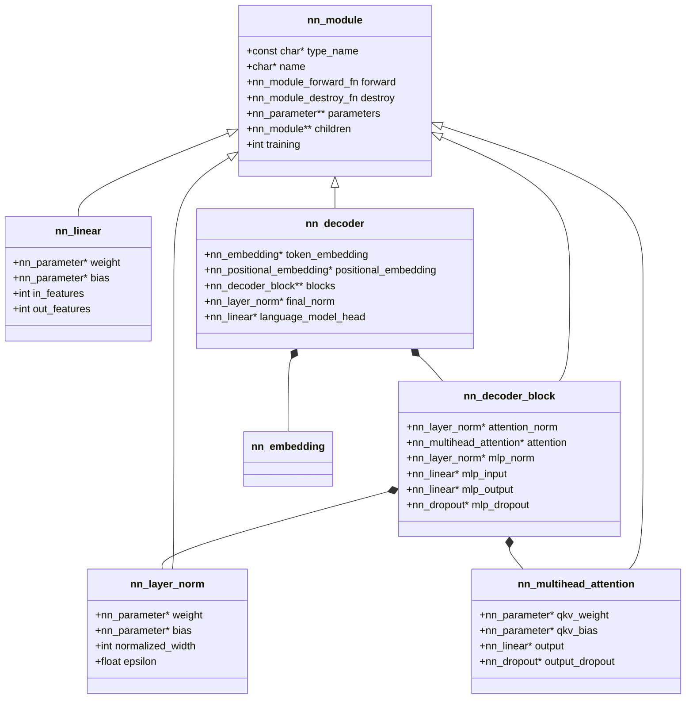
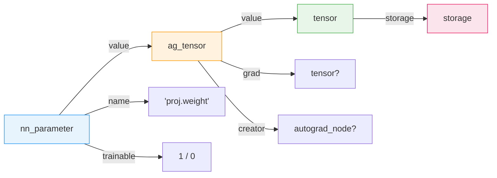
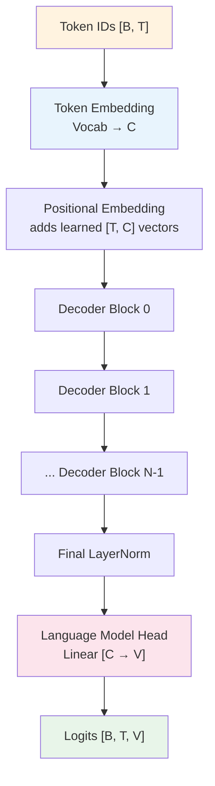
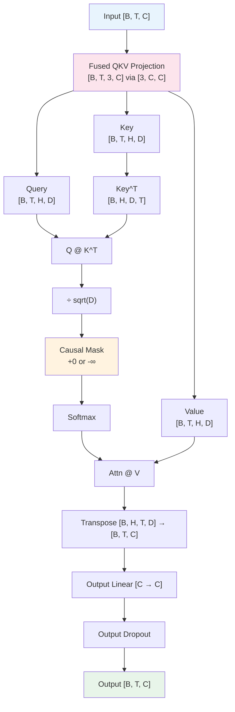
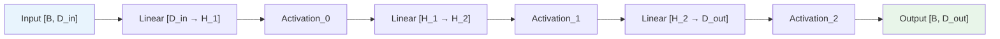
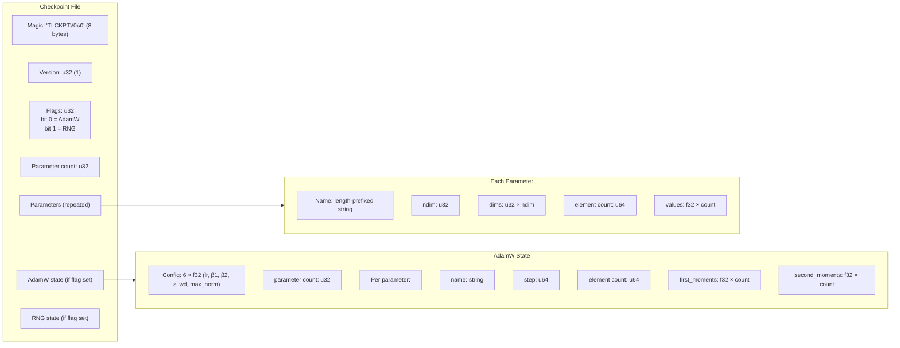

# Neural Network Modules

TensorLib's neural network component provides a complete, from-scratch deep learning module system in C99. It implements a composable module hierarchy with automatic parameter management, differentiable forward passes, loss functions, optimizers, and checkpoint serialization — all built on top of the autograd engine.

> **See also:** [tensor_mechanics.md](./tensor_mechanics.md) for base tensor ops, [autograd_engine.md](./autograd_engine.md) for gradient computation, and [decoder_implementation.md](./decoder_implementation.md) for the full GPT-style decoder.

---

## 1. Overview

The `nn` component provides:

- **Module system** — composable parent/child hierarchy with virtual dispatch via function pointers
- **Parameter system** — named, trainable tensors with automatic weight initialization
- **Layer library** — Linear, Embedding, PositionalEmbedding, LayerNorm, Dropout, MultiheadAttention, MLP, DecoderBlock, and a full causal language model Decoder
- **Loss functions** — numerically stable softmax, log-softmax, and cross-entropy
- **Optimizers** — SGD and AdamW (with decoupled weight decay and gradient clipping)
- **RNG** — deterministic splitmix64 PRNG for reproducible initialization and dropout
- **Checkpointing** — atomic binary save/load of model params, optimizer state, and RNG state

### Comparison to PyTorch's `nn.Module`

TensorLib's `nn_module` serves the same role as PyTorch's [`torch.nn.Module`](https://github.com/pytorch/pytorch/blob/main/torch/nn/modules/module.py). The key differences:

| Feature | PyTorch | TensorLib |
|---|---|---|
| Language | Python (with C++ extensions) | Pure C99 |
| Module composition | `self.linear = nn.Linear(...)` in `__init__` | `nn_module_register_child()` / `nn_module_register_parameter()` |
| Parameter access | `module.parameters()` (generator) | `nn_module_parameter_at()` (index-based) |
| Forward dispatch | `__call__` → `forward()` (Python override) | `nn_module_forward()` → function pointer callback |
| Train/eval mode | `module.train()` / `module.eval()` | `nn_module_set_training()` (recursive) |
| Memory management | Python garbage collector | Manual `create`/`destroy` pairs |
| Serialization | `torch.save` (pickle) | Custom binary format with magic `TLCKPT` |

TensorLib also draws design inspiration from [ggml's `ggml_build_forward`](https://github.com/ggerganov/llama.cpp/blob/master/ggml.c) for its graph-based autograd approach, where each forward pass builds a computation graph that can later be traversed in reverse for backpropagation.

---

## 2. Module System

### The `nn_module` Struct

Every layer in TensorLib embeds an `nn_module` as its first member, enabling C-style polymorphism through composition (the "first-member" pattern):

```c
struct nn_module {
    const char* type_name;          // e.g. "Linear", "LayerNorm"
    char* name;                     // caller-assigned instance name

    nn_module_forward_fn forward;   // virtual dispatch callback
    nn_module_destroy_fn destroy;   // virtual destructor

    nn_parameter** parameters;      // direct parameters (weight tensors)
    size_t parameter_count;
    size_t parameter_capacity;

    nn_module** children;           // sub-modules
    size_t child_count;
    size_t child_capacity;

    int training;                   // 1 = train, 0 = eval
};
```

Derived layer types embed `nn_module` as their first field, allowing safe casting:

```c
struct nn_linear {
    nn_module base;         // must be first
    nn_parameter* weight;
    nn_parameter* bias;
    int in_features;
    int out_features;
    int use_bias;
};
```

This mirrors the inheritance pattern in C++ where `nn_linear*` can be treated as `nn_module*`.

### Module Composition

Modules form a tree. Parent modules own references to their children and parameters:

```c
nn_linear* linear = nn_linear_create("proj", 64, 128, 1, ...);
nn_module_register_child(&parent->base, &linear->base);
```

Child registration includes cycle detection — `nn_module_register_child` rejects additions that would create a cycle (the target module already contains the parent).



### Forward Dispatch

`nn_module_forward` invokes the function pointer set during construction:

```c
ag_tensor* nn_module_forward(const nn_module* module, const ag_tensor* input)
{
    if (module == NULL || input == NULL || module->forward == NULL) return NULL;
    return module->forward(module, input);
}
```

Each concrete layer provides a thin wrapper that casts back to the concrete type:

```c
// From linear.c
static ag_tensor* nn_linear_module_forward(const nn_module* module,
                                           const ag_tensor* input)
{
    return nn_linear_forward((const nn_linear*)module, input);
}
```

This is registered during `_create` via `nn_module_init_base()`.

### Train/Eval Mode

`nn_module_set_training` recursively sets the `training` flag on the module and all descendants:

```c
void nn_module_set_training(nn_module* module, int training)
{
    if (module == NULL) return;
    module->training = training != 0;
    for (size_t i = 0; i < module->child_count; ++i) {
        nn_module_set_training(module->children[i], training);
    }
}
```

Stochastic modules (like Dropout) check `nn_module_is_training()` during forward. In eval mode, dropout returns the input unchanged.

### Parameter Counting and Access

`nn_module_parameter_count` recursively counts all parameters across the entire tree. `nn_module_parameter_at` uses depth-first traversal to access the *i*-th parameter by flat index:

```c
size_t nn_module_parameter_count(const nn_module* module)
{
    size_t count = module->parameter_count;
    for (size_t i = 0; i < module->child_count; ++i) {
        count += nn_module_parameter_count(module->children[i]);
    }
    return count;
}
```

### Gradient Zeroing

`nn_module_zero_grad` recursively zeros gradients on all trainable parameters across the entire tree by calling `ag_zero_grad` on each parameter's `ag_tensor`.

### Comparison to PyTorch

| TensorLib | PyTorch |
|---|---|
| `nn_module_register_child()` | `self.child = submodule` (in `__init__`) |
| `nn_module_register_parameter()` | `self.param = nn.Parameter(...)` |
| `nn_module_parameter_count()` | `sum(p.numel() for p in module.parameters())` |
| `nn_module_parameter_at(i)` | `list(module.parameters())[i]` |
| `nn_module_set_training(0)` | `module.eval()` |
| `nn_module_zero_grad()` | `module.zero_grad()` |
| `nn_module_forward()` | `module(input)` |

---

## 3. Parameter System

### The `nn_parameter` Struct

```c
struct nn_parameter {
    char* name;           // unique dotted name, e.g. "proj.weight"
    ag_tensor* value;     // autograd-wrapped tensor
    int trainable;        // 1 = accumulate gradients, 0 = frozen
};
```

A parameter wraps an `ag_tensor` (see [autograd_engine.md](./autograd_engine.md)) with a unique name and a trainable flag. The name is used for checkpoint serialization and deduplication.



### Creation

`nn_parameter_create` allocates the tensor, initializes weights according to the chosen policy, and wraps it as an autograd leaf:

```c
nn_parameter* nn_parameter_create(
    const char* name,
    int ndim,
    const int* dims,
    int trainable,
    nn_init_kind initializer,
    nn_rng* rng
);
```

Ownership flows as: caller owns the `nn_parameter*`, the module's `parameters[]` array holds non-owning references. When the module is destroyed via `nn_module_destroy_base`, all registered parameters are destroyed.

---

## 4. Weight Initialization & RNG

### Splitmix64 PRNG

TensorLib uses a deterministic [splitmix64](https://xoshiro.di.unimi.it/splitmix64.c) PRNG. The state is a single `uint64_t`:

```c
struct nn_rng {
    uint64_t state;
};
```

The core PRNG produces a 64-bit integer by mixing with the golden ratio constant:

```c
static uint64_t nn_rng_next_u64(nn_rng* rng)
{
    rng->state += 0x9E3779B97F4A7C15;  // golden ratio increment
    uint64_t value = rng->state;
    value = (value ^ (value >> 30)) * 0xBF58476D1CE4E5B9;
    value = (value ^ (value >> 27)) * 0x94D049BB133111EB;
    return value ^ (value >> 31);
}
```

The top 24 bits are extracted for float conversion, giving ~24-bit precision:

```c
static float nn_rng_unit(nn_rng* rng)
{
    return (float)(nn_rng_next_u64(rng) >> 40) * (1.0f / 16777216.0f);
}
```

### Distributions

**Uniform:** Simple linear rescaling of the unit random:

```c
float nn_rng_uniform(nn_rng* rng, float min, float max)
{
    return min + (max - min) * nn_rng_unit(rng);
}
```

**Normal:** Box-Muller transform with rejection-sampled `u1` for log safety:

```c
float nn_rng_normal(nn_rng* rng, float mean, float stddev)
{
    float u1 = ((float)(nn_rng_next_u64(rng) >> 40) + 1.0f) / 16777217.0f;
    float u2 = nn_rng_unit(rng);
    return mean + stddev * sqrtf(-2.0f * logf(u1)) * cosf(6.28318530717958647692f * u2);
}
```

Both return `NAN` on invalid inputs and are fully deterministic given the same seed.

### Initialization Policies

The `nn_init_kind` enum controls weight initialization:

| Policy | Formula | Use Case |
|---|---|---|
| `NN_INIT_ZERO` | `W = 0` | Zero bias, attention QKV init |
| `NN_INIT_ONE` | `W = 1` | LayerNorm weight |
| `NN_INIT_XAVIER_UNIFORM` | `U(-sqrt(6/(fan_in+fan_out)), sqrt(6/(fan_in+fan_out)))` | Linear weights, Embeddings |
| `NN_INIT_XAVIER_NORMAL` | `N(0, sqrt(2/(fan_in+fan_out)))` | Alternative Linear init |
| `NN_INIT_HE_UNIFORM` | `U(-sqrt(6/fan_in), sqrt(6/fan_in))` | ReLU networks |
| `NN_INIT_HE_NORMAL` | `N(0, sqrt(2/fan_in))` | ReLU networks |

Fan-in and fan-out are computed from the weight tensor shape, treating dimensions beyond the first two as a receptive field multiplier.

The attention QKV weight uses a custom init of `U(-sqrt(3/C), sqrt(3/C))` applied after zero-init, as a distinct scaling choice.

---

## 5. Individual Layers

### 5.1 Linear (Fully Connected)

**Purpose:** Standard affine transformation with optional bias.

**Parameters:**
- `weight`: shape `[out_features, in_features]` — initialized with `weight_init`
- `bias` (optional): shape `[out_features]` — initialized with `bias_init`

**Forward pass math:**

$$y = x W^T + b$$

**Implementation:** The weight is transposed via `ag_transpose`, multiplied with the input via `ag_matmul`, and the bias is added via `ag_add`:

```c
ag_tensor* nn_linear_forward(const nn_linear* layer, const ag_tensor* input)
{
    ag_tensor* transposed = ag_transpose(layer->weight->value, 0, 1);
    ag_tensor* product = ag_matmul(input, transposed);
    ag_tensor_release(transposed);
    if (!layer->use_bias) return product;
    ag_tensor* result = ag_add(product, layer->bias->value);
    ag_tensor_release(product);
    return result;
}
```

**Backward gradient:** Computed automatically by the autograd graph — `ag_transpose` and `ag_matmul` each have backward implementations.

**PyTorch comparison:** Equivalent to `nn.Linear(in_features, out_features, bias=True)`. The weight shape `[out, in]` and the `x @ W^T` convention match PyTorch exactly.

---

### 5.2 Embedding

**Purpose:** Lookup table that maps integer token IDs to dense vectors.

**Parameters:**
- `weight`: shape `[vocabulary_size, embedding_width]` — initialized with `weight_init`

**Forward pass:** Uses `ag_gather_rows` to select rows by token index:

```c
ag_tensor* nn_embedding_forward(const nn_embedding* layer, const ag_tensor* indices)
{
    return ag_gather_rows(layer->weight->value, indices->value);
}
```

Input must be a float tensor containing integer token IDs with `requires_grad == 0`. The output is differentiable w.r.t. the weight matrix.

**PyTorch comparison:** Equivalent to `nn.Embedding(vocab_size, dim)`. Both store a `[V, D]` weight and look up by row index. Gradients flow into the weight (sparse update).

---

### 5.3 Positional Embedding

**Purpose:** Adds learned position vectors to token embeddings, giving the model sequence order information.

**Parameters:**
- Internally owns an `nn_embedding` table of shape `[context_length, embedding_width]`

**Forward pass:** Generates position IDs `[0, 1, 2, ..., T-1]` from the sequence length, looks them up in the internal embedding table, and adds the result to the token embeddings:

```c
ag_tensor* nn_positional_embedding_forward(
    const nn_positional_embedding* layer,
    const ag_tensor* token_embeddings)
{
    // ... generate position_ids [T] ...
    positions = nn_embedding_forward(layer->table, position_ids);
    result = ag_add(token_embeddings, positions);
    return result;
}
```

Input shape: `[B, T, C]`. Output shape: `[B, T, C]` (same — addition).

The internal embedding is registered as a child module, so its parameter appears in the parent's parameter count automatically.



---

### 5.4 Layer Normalization

**Purpose:** Normalizes the last dimension of the input to zero mean and unit variance, with optional learned affine scale and shift.

**Parameters (when `affine=1`):**
- `weight`: shape `[normalized_width]` — initialized to 1 (`NN_INIT_ONE`)
- `bias`: shape `[normalized_width]` — initialized to 0 (`NN_INIT_ZERO`)

**Forward pass math:**

$$\mu = \frac{1}{C} \sum_{i=1}^{C} x_i$$

$$\sigma^2 = \frac{1}{C} \sum_{i=1}^{C} (x_i - \mu)^2$$

$$\hat{x}_i = \frac{x_i - \mu}{\sqrt{\sigma^2 + \epsilon}}$$

$$y_i = \gamma_i \hat{x}_i + \beta_i$$

**Implementation:** Builds a chain of autograd ops: `ag_mean` → `ag_sub` → `ag_mul` → `ag_mean` → `ag_add` (epsilon) → `ag_sqrt` → `ag_div` → `ag_mul` (gamma) → `ag_add` (beta).

**PyTorch comparison:** Equivalent to `nn.LayerNorm(normalized_shape, eps=1e-5, elementwise_affine=True)`. Uses biased variance (divides by *C*, not *C-1*).

---

### 5.5 Dropout

**Purpose:** Regularization layer that randomly zeros elements during training.

**Parameters:** None (stateless — uses the RNG reference).

**Forward pass math (inverted dropout):**

$$y_i = \begin{cases} 0 & \text{if } u_i < p \\ \frac{x_i}{1-p} & \text{otherwise} \end{cases}$$

where $u_i \sim \text{Uniform}(0, 1)$ and $p$ is the dropout probability.

**Key behavior:**
- **Training mode:** Samples a binary mask, scales surviving elements by $1/(1-p)$ (inverted dropout).
- **Eval mode:** Returns the input unchanged — no mask sampling, no RNG advancement.
- **Probability = 0:** Returns input directly without allocating a mask.

```c
if (!nn_module_is_training(&layer->base) || layer->probability == 0.0f) {
    ag_tensor_retain((ag_tensor*)input);
    return (ag_tensor*)input;
}
```

The RNG is stored as a non-owning reference (`nn_dropout` does not own the `nn_rng`). The RNG must outlive the dropout module.

**PyTorch comparison:** Equivalent to `nn.Dropout(p)`. Both use inverted dropout scaling. The probability must be `[0, 1)`.

---

### 5.6 Multi-Head Attention

**Purpose:** Decoder-style causal self-attention with fused Q/K/V projections.

**Parameters:**
- `qkv_weight`: shape `[3, C, C]` — fused Q/K/V projection weights
- `qkv_bias`: shape `[3, C]` — fused Q/K/V biases
- `output`: `nn_linear` child module for the output projection `[C → C]`
- `output_dropout`: `nn_dropout` child module

**Channels must divide evenly across heads:** `head_width = channels / head_count`.



**Forward pass algorithm:**

1. **Fused QKV projection:** Reshape input to `[1, B, T, C]`, multiply by `[3, 1, C, C]` weight and add `[3, 1, 1, C]` bias. This produces all three projections in one matmul.

2. **Split and reshape:** Slice along the projection dimension, reshape each to `[B, T, H, D]`, then transpose to `[B, H, T, D]` for batched attention.

3. **Scaled dot-product attention:**
   - Compute scores: $\text{scores} = Q \cdot K^T / \sqrt{D}$
   - Apply causal mask via `nn_apply_causal_mask` (sets positions above the diagonal to $-\infty$)
   - Apply softmax: $\text{probs} = \text{softmax}(\text{scores})$
   - Compute context: $\text{context} = \text{probs} \cdot V$

4. **Merge heads:** Transpose from `[B, H, T, D]` to `[B, T, C]`.

5. **Output projection:** Linear layer `[C → C]` followed by dropout.

**PyTorch comparison:** Similar to `nn.MultiheadAttention(embed_dim, num_heads, dropout)` in self-attention mode, but always causal and with a fused QKV weight matrix. Unlike FlashAttention, TensorLib materializes the full attention matrix — this is a reference implementation, not optimized for memory or compute.

---

### 5.7 MLP (Multi-Layer Perceptron)

**Purpose:** Configurable feed-forward network with arbitrary hidden sizes and activations. Used as the transformer FFN.

**Parameters:** Internally creates `hidden_count + 1` `nn_linear` layers registered as children.

**Configuration:**

```c
struct nn_mlp_config {
    int input_features;
    const int* hidden_sizes;        // array of hidden layer sizes
    size_t hidden_count;            // number of hidden layers
    int output_features;
    const nn_activation* activations;  // array of (hidden_count + 1) activations
    int use_bias;
    nn_init_kind weight_init;
    nn_init_kind bias_init;
};
```

**Forward pass:** Chains `Linear → Activation → Linear → Activation → ... → Linear`:

```c
for (size_t i = 0; i < model->layer_count; ++i) {
    current = nn_module_forward(model->base.children[i], current);  // Linear
    if (model->activations[i].forward != NULL) {
        current = model->activations[i].forward(&model->activations[i], current);
    }
}
```

The final layer uses the last activation from the activations array (typically a no-op or identity for output layers).

**Built-in activations:** `nn_activation_relu()`, `nn_activation_gelu()`, `nn_activation_sigmoid()`, `nn_activation_tanh()`. Custom activations can be created with `nn_activation_custom()`.

**PyTorch comparison:** Similar to stacking `nn.Linear` + activations. The decoder block's FFN uses a 2-layer MLP with GELU (hidden size = 4× channels), matching the standard transformer architecture.



Each `Linear` is registered as a child module; activations are stored in the `activations[]` array and applied between layers.

---

## 6. Loss Functions

### Softmax and Log-Softmax

**Numerically stable log-softmax** using the log-sum-exp trick:

$$\text{log\_softmax}(x_i) = x_i - \max(x) - \log\left(\sum_j e^{x_j - \max(x)}\right)$$

**Softmax** is implemented as `exp(log_softmax(x))` for numerical consistency:

```c
ag_tensor* nn_softmax(const ag_tensor* logits)
{
    ag_tensor* log_probabilities = nn_log_softmax(logits);
    ag_tensor* probabilities = ag_exp(log_probabilities);
    ag_tensor_release(log_probabilities);
    return probabilities;
}
```

### Cross-Entropy Loss

**Implementation:** Computes `NLLLoss(log_softmax(logits), targets)`:

1. Validates target classes are in `[0, num_classes)`
2. Builds a one-hot selector matrix from the integer targets
3. Computes `log_softmax(logits)`
4. Multiplies with the selector and sums over the class dimension
5. Negates and takes the global mean

**Formula:**

$$\mathcal{L} = -\frac{1}{N} \sum_{i=1}^{N} \log p_{y_i}(x_i)$$

**PyTorch comparison:** Equivalent to `nn.CrossEntropyLoss()` which combines `nn.LogSoftmax` and `nn.NLLLoss`. The targets are class indices (not one-hot), matching PyTorch's convention.

### Causal Mask

`nn_apply_causal_mask` adds a lower-triangular mask to attention scores:

```c
ag_tensor* nn_apply_causal_mask(const ag_tensor* scores)
{
    // Creates [T, T] mask: 0.0 on and below diagonal, -INFINITY above
    for (int row = 0; row < sequence; ++row)
        for (int column = 0; column < sequence; ++column)
            mask_value->storage->data[row * sequence + column] =
                column <= row ? 0.0f : -INFINITY;
    return ag_add(scores, mask);
}
```

This is applied to 2D slices of the attention score tensor `[B, H, T, T]`.

---

## 7. Optimizers

### 7.1 SGD

**Purpose:** Stochastic gradient descent with optional per-parameter learning rates.

```c
nn_sgd* nn_sgd_create(nn_module* module, float learning_rate);
int nn_sgd_step(nn_sgd* optimizer);
void nn_sgd_zero_grad(nn_sgd* optimizer);
```

**Update rule:**

$$\theta_{t+1} = \theta_t - \eta \cdot g_t$$

The SGD optimizer iterates all parameters (recursively via `nn_module_parameter_at`), validates gradient shapes and finiteness, and applies the update element-wise. It skips non-trainable parameters. After updating, it calls `tensor_mark_modified` to invalidate any cached views.

**Validation:** Before applying updates, `nn_sgd_step` validates:
- Module topology integrity
- Gradient shapes match parameter shapes
- All values and gradients are finite
- The resulting updated values are finite

### 7.2 AdamW

**Purpose:** AdamW optimizer with decoupled weight decay, bias correction, and global gradient norm clipping.

```c
nn_adamw_config nn_adamw_default_config(void);  // lr=1e-3, β1=0.9, β2=0.999, ...
nn_adamw* nn_adamw_create(nn_module* module, const nn_adamw_config* config);
int nn_adamw_step(nn_adamw* optimizer);
void nn_adamw_zero_grad(nn_adamw* optimizer);
```

**Internal state (per parameter):**
- `first_moments[i]` — exponential moving average of gradients ($m_t$)
- `second_moments[i]` — exponential moving average of squared gradients ($v_t$)
- `steps[i]` — step counter for bias correction

**Update rules:**

$$m_t = \beta_1 \cdot m_{t-1} + (1 - \beta_1) \cdot g_t$$

$$v_t = \beta_2 \cdot v_{t-1} + (1 - \beta_2) \cdot g_t^2$$

$$\hat{m}_t = \frac{m_t}{1 - \beta_1^t}, \quad \hat{v}_t = \frac{v_t}{1 - \beta_2^t}$$

$$\theta_{t+1} = \theta_t - \eta \cdot \left(\frac{\hat{m}_t}{\sqrt{\hat{v}_t} + \epsilon} + \lambda \cdot \theta_t\right)$$

**Gradient norm clipping:** If `max_grad_norm > 0`, the global L2 norm of all gradients is computed. If it exceeds `max_grad_norm`, all gradients are scaled down by `max_grad_norm / norm`.

**PyTorch comparison:** Matches [`torch.optim.AdamW`](https://github.com/pytorch/pytorch/blob/main/torch/optim/adamw.py) with decoupled weight decay (not L2 regularization). Default parameters (`lr=1e-3`, `betas=(0.9, 0.999)`, `eps=1e-8`, `weight_decay=0.01`) match PyTorch's defaults. The gradient clipping is applied inside the step, equivalent to calling `torch.nn.utils.clip_grad_norm_` before the optimizer step.

### Shared Utilities

`nn_module_zero_grad` and `nn_clip_grad_norm` are optimizer-independent and available for any module:

```c
void nn_module_zero_grad(nn_module* module);
int nn_clip_grad_norm(nn_module* module, float max_norm, float* total_norm);
```

---

## 8. Serialization (Checkpointing)

TensorLib provides atomic checkpoint save/load for model parameters, AdamW optimizer state, and RNG state.

### Binary Format



### Format Details

| Field | Type | Description |
|---|---|---|
| Magic | `uint8_t[8]` | `TLCKPT\0\0` |
| Version | `uint32_t` | Currently `1` |
| Flags | `uint32_t` | Bit 0: AdamW state present. Bit 1: RNG state present. |
| Parameter count | `uint32_t` | Number of parameters |
| Parameter name | string | Length-prefixed (u32 length + bytes) |
| Parameter ndim | `uint32_t` | Number of dimensions |
| Parameter dims | `uint32_t[]` | Dimension sizes |
| Element count | `uint64_t` | Total elements (verified against dims) |
| Values | `float[]` | All tensor elements as IEEE 754, little-endian |

All multi-byte values are serialized in **little-endian** byte order.

### Atomic Writes

Save operations are atomic — data is written to a temporary file (`path + ".tmp"`) and then atomically renamed to the final path. On Windows, `MoveFileExA` with `MOVEFILE_REPLACE_EXISTING | MOVEFILE_WRITE_THROUGH` is used; on POSIX, `rename()`:

```c
#ifdef _WIN32
    return MoveFileExA(temporary, destination,
                       MOVEFILE_REPLACE_EXISTING | MOVEFILE_WRITE_THROUGH) != 0;
#else
    return rename(temporary, destination) == 0;
#endif
```

If any error occurs during write, the temporary file is deleted and the original file is untouched.

### Loading Safety

Loading is **transactional**: the checkpoint is fully parsed and validated against the live module before any state is modified. Validation checks include:
- Magic bytes and version match
- All parameter names are unique and exist in the live module
- All parameter shapes match exactly
- AdamW parameter count and shapes match (if present)
- All values are finite
- No trailing data after the last section

If any check fails, `nn_checkpoint_load` returns `-1` and leaves all live state intact.

The loader also supports a legacy format with magic `TLWEIGHT` (no AdamW/RNG sections).

### PyTorch Comparison

PyTorch uses Python's `pickle` for `torch.save`/`torch.load`, which can serialize arbitrary Python objects but has security implications. TensorLib's custom binary format is simpler, safer (no arbitrary code execution), and versioned for forward compatibility. However, it only serializes the specific data needed for training (parameters, optimizer state, RNG) — not arbitrary model objects.

---

## 9. API Reference

### Module System

| Function | Description |
|---|---|
| `nn_module_forward(module, input)` | Execute forward pass via virtual dispatch |
| `nn_module_set_training(module, training)` | Recursively set train/eval mode |
| `nn_module_is_training(module)` | Query current training flag |
| `nn_module_register_parameter(module, param)` | Register a parameter with the module |
| `nn_module_register_child(module, child)` | Register a sub-module (with cycle detection) |
| `nn_module_parameter_count(module)` | Count all parameters recursively |
| `nn_module_parameter_at(module, index)` | Get parameter by flat index |
| `nn_module_zero_grad(module)` | Recursively zero all parameter gradients |
| `nn_clip_grad_norm(module, max_norm, total_norm)` | Clip gradient L2 norm globally |

### Activations

| Function | Description |
|---|---|
| `nn_activation_relu()` | ReLU activation |
| `nn_activation_gelu()` | GELU activation |
| `nn_activation_sigmoid()` | Sigmoid activation |
| `nn_activation_tanh()` | Tanh activation |
| `nn_activation_custom(name, forward, ctx)` | Caller-defined activation |

### Parameters

| Function | Description |
|---|---|
| `nn_parameter_create(name, ndim, dims, trainable, init, rng)` | Create a parameter with initialized tensor |
| `nn_parameter_destroy(param)` | Free a parameter and its tensor |

### RNG

| Function | Description |
|---|---|
| `nn_rng_seed(rng, seed)` | Set the RNG state |
| `nn_rng_uniform(rng, min, max)` | Sample from Uniform[min, max] |
| `nn_rng_normal(rng, mean, stddev)` | Sample from Normal(mean, stddev) |

### Layers

| Function | Description |
|---|---|
| `nn_linear_create(name, in, out, bias, w_init, b_init, rng)` | Create linear layer |
| `nn_linear_forward(layer, input)` | Forward pass: `x @ W^T + b` |
| `nn_linear_destroy(layer)` | Free linear layer |
| `nn_embedding_create(name, vocab, dim, init, rng)` | Create embedding layer |
| `nn_embedding_forward(layer, indices)` | Lookup embeddings by token ID |
| `nn_embedding_destroy(layer)` | Free embedding layer |
| `nn_positional_embedding_create(name, ctx_len, dim, init, rng)` | Create positional embedding |
| `nn_positional_embedding_forward(layer, token_emb)` | Add positional info to token embeddings |
| `nn_positional_embedding_destroy(layer)` | Free positional embedding |
| `nn_layer_norm_create(name, width, eps, affine)` | Create layer normalization |
| `nn_layer_norm_forward(layer, input)` | Normalize last dimension |
| `nn_layer_norm_destroy(layer)` | Free layer normalization |
| `nn_dropout_create(name, probability, rng)` | Create dropout layer |
| `nn_dropout_forward(layer, input)` | Apply dropout (train) or identity (eval) |
| `nn_dropout_destroy(layer)` | Free dropout layer |
| `nn_multihead_attention_create(name, C, heads, drop_p, rng)` | Create multi-head attention |
| `nn_multihead_attention_forward(attn, input)` | Causal self-attention forward |
| `nn_multihead_attention_destroy(attn)` | Free multi-head attention |
| `nn_decoder_block_create(name, C, heads, drop_p, eps, rng)` | Create pre-norm decoder block |
| `nn_decoder_block_forward(block, input)` | Forward through attention + FFN block |
| `nn_decoder_block_destroy(block)` | Free decoder block |
| `nn_decoder_create(name, config, rng)` | Create full decoder (GPT-style) |
| `nn_decoder_forward(decoder, token_ids)` | Forward pass returning logits `[B,T,V]` |
| `nn_decoder_loss(decoder, token_ids, targets)` | Forward + cross-entropy loss (scalar) |
| `nn_decoder_destroy(decoder)` | Free decoder |
| `nn_mlp_create(name, config, rng)` | Create multi-layer perceptron |
| `nn_mlp_forward(model, input)` | Forward through all layers + activations |
| `nn_mlp_destroy(model)` | Free MLP |

### Losses

| Function | Description |
|---|---|
| `nn_softmax(logits)` | Numerically stable softmax |
| `nn_log_softmax(logits)` | Numerically stable log-softmax |
| `nn_cross_entropy(logits, targets)` | Cross-entropy loss (mean scalar) |
| `nn_apply_causal_mask(scores)` | Apply lower-triangular causal mask |

### Optimizers

| Function | Description |
|---|---|
| `nn_sgd_create(module, lr)` | Create SGD optimizer |
| `nn_sgd_step(optimizer)` | Apply one SGD update step |
| `nn_sgd_zero_grad(optimizer)` | Zero all gradients |
| `nn_sgd_destroy(optimizer)` | Free SGD optimizer |
| `nn_adamw_default_config()` | Get default AdamW config |
| `nn_adamw_create(module, config)` | Create AdamW optimizer |
| `nn_adamw_step(optimizer)` | Apply one AdamW update step |
| `nn_adamw_zero_grad(optimizer)` | Zero all gradients |
| `nn_adamw_destroy(optimizer)` | Free AdamW optimizer |

### Checkpointing

| Function | Description |
|---|---|
| `nn_checkpoint_save(path, module, optimizer, rng)` | Save checkpoint (atomic) |
| `nn_checkpoint_load(path, module, optimizer, rng)` | Load checkpoint (transactional) |

---

## 10. Test Coverage

The test suite consists of **18 test files** covering every component of the NN system:

| Test File | What It Covers |
|---|---|
| `test_nn_rng.c` | Splitmix64 reproducibility, uniform/normal distribution, boundary checks, determinism across seeds |
| `test_nn_init.c` | All 6 init policies: zero, one, Xavier uniform/normal, He uniform/normal. Verifies reproducibility with same seed, divergence with different seeds, and range/bounds |
| `test_nn_parameter.c` | Parameter creation, name copying (ownership), trainable flag, tensor shape/strides, all init policies, NULL/empty name rejection |
| `test_nn_module.c` | Module creation/destroy, parent/child hierarchy, cycle detection in `register_child`, duplicate rejection, parameter counting, parameter access by index, recursive train/eval propagation, forward dispatch, zero_grad, destroy verification |
| `test_nn_linear.c` | Constructor validation, known-weight forward pass (hand-computed), biasless mode, generic module forward, dimension mismatch rejection |
| `test_nn_embedding.c` | Lookup correctness, gradient rejection (non-differentiable input), shape validation, generic module forward |
| `test_nn_positional_embedding.c` | Exact composition with manual weights, backward pass through positional params, sequence length validation, context length bounds |
| `test_nn_layer_norm.c` | Forward correctness (hand-computed expected values), backward gradient correctness, non-affine mode, epsilon validation, dimension mismatch |
| `test_nn_dropout.c` | Deterministic training (same seed → same mask), inverted dropout scaling, eval mode identity, backward gradient propagation, p=0.0 passthrough, non-training-mode passthrough |
| `test_nn_multihead_attention.c` | Identity QKV projection correctness, causal masking verification, multi-head correctness, dimension mismatch rejection, backward pass |
| `test_nn_decoder_block.c` | Residual connection verification (zero branches → identity), 6-child topology, backward gradient flow, dimension validation |
| `test_nn_decoder.c` | Full topology (all children registered), forward pass shape, loss computation, backward pass, train/eval mode propagation, config validation |
| `test_nn_mlp.c` | Layer count, child registration, forward correctness with ReLU+identity, custom activations, config validation, reproducibility |
| `test_nn_loss.c` | Softmax correctness (with extreme values), log-softmax correctness, cross-entropy forward/backward, target validation |
| `test_nn_causal_mask.c` | Mask correctness (diagonal and above), softmax after masking, backward pass, dimension validation |
| `test_nn_checkpoint.c` | Round-trip save/load, resume training after load, legacy format, flag-only loading (params only, no optimizer/RNG), corruption detection, dimension mismatch, duplicate name rejection, atomic failure cleanup |
| `test_nn_sgd.c` | Recursive update through children, bias/non-trainable skipping, zero_grad, version tracking, invalid module rejection, negative LR rejection |
| `test_nn_adamw.c` | Exact first-step computation (hand-verified), global gradient clipping, zero_grad, config validation, beta bounds, invalid module rejection |

---

## 11. Design Decisions

### C-Style OOP (Function Pointers) vs C++ Vtables

TensorLib uses **manual function-pointer dispatch** rather than C++ virtual tables:

```c
struct nn_module {
    nn_module_forward_fn forward;   // manual vtable entry
    nn_module_destroy_fn destroy;   // manual vtable entry
};
```

**Why:**
- C99 is the target language, keeping the project free of C++ complexity and compiler requirements
- Function pointers are explicit and inspectable — no hidden vptr or compiler-injected destructors
- The "first-member embedding" pattern (`nn_linear` has `nn_module base` as its first field) provides safe pointer casting without `container_of` macros, relying on C's guarantee that a pointer to a struct can be cast to a pointer to its first member
- Destroy callbacks are explicit, avoiding C++ destructor ordering surprises

The trade-off is that adding a new virtual method requires manually wiring it in every layer's `_create` function — there is no compiler enforcement of interface conformance.

### Manual Memory Management for Modules

Every `nn_*_create` has a matching `nn_*_destroy`. Modules own their children and parameters:

- `nn_module_destroy_base` iterates `parameters[]` calling `nn_parameter_destroy`, then iterates `children[]` calling each child's `destroy` callback, and finally frees the arrays
- This means destroying a root module recursively destroys the entire tree

**Why not reference counting?**
- Simplicity: explicit ownership avoids the complexity of reference cycles and atomic operations
- Performance: no atomic increment/decrement overhead per operation
- Predictability: cleanup is deterministic and happens exactly at `_destroy` calls
- The module tree is acyclic by construction (enforced by `nn_module_register_child`)

### Pre-Norm vs Post-Norm Transformer

TensorLib uses **pre-norm** architecture (LayerNorm before attention/FFN, not after):

```c
// From decoder_block.c
normalized_attention = nn_layer_norm_forward(block->attention_norm, input);
attention_output = nn_multihead_attention_forward(block->attention, normalized_attention);
attention_residual = ag_add(input, attention_output);  // residual before FFN
normalized_mlp = nn_layer_norm_forward(block->mlp_norm, attention_residual);
// ... FFN ...
result = ag_add(attention_residual, dropped);
```

**Why pre-norm:**
- **Training stability:** Pre-norm transformers are significantly easier to train at depth. The residual stream provides a direct gradient path that bypasses the LayerNorm and attention layers, mitigating vanishing/exploding gradients.
- **No warmup needed:** Pre-norm architectures are less sensitive to learning rate warmup schedules, which is important for a from-scratch implementation without LR scheduling.
- **Industry standard:** GPT-2, GPT-3, LLaMA, and most modern language models use pre-norm. The post-norm variant (original Transformer) requires careful initialization and warmup.

The trade-off is that pre-norm can be slightly less performant at convergence compared to well-tuned post-norm, but the stability benefits dominate for practical training.
