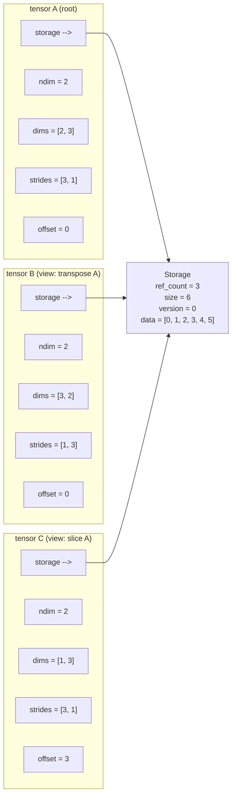
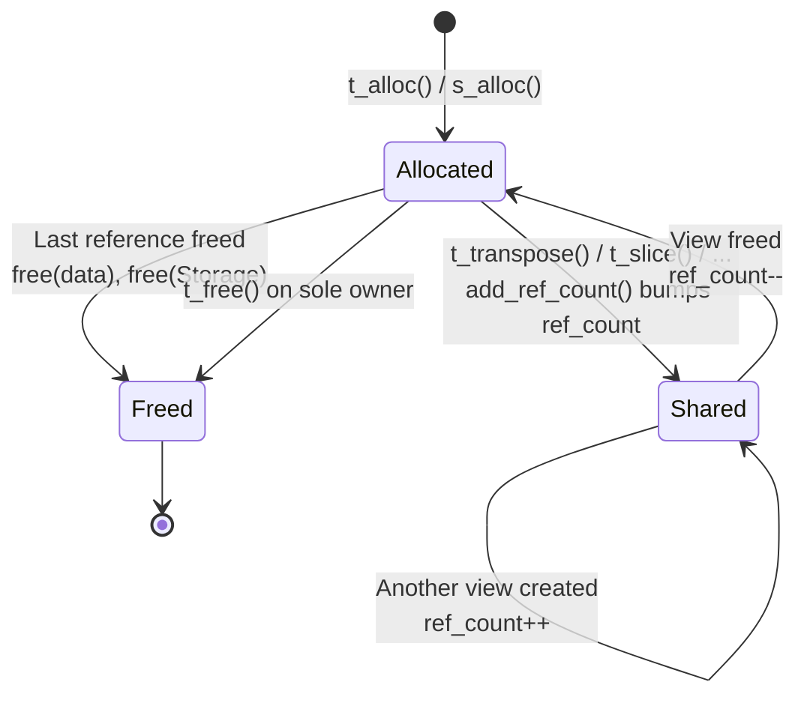
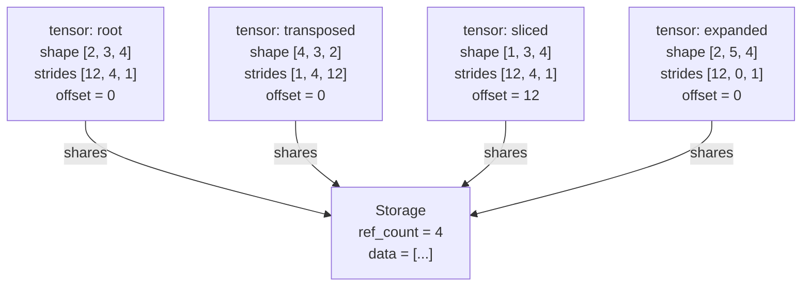
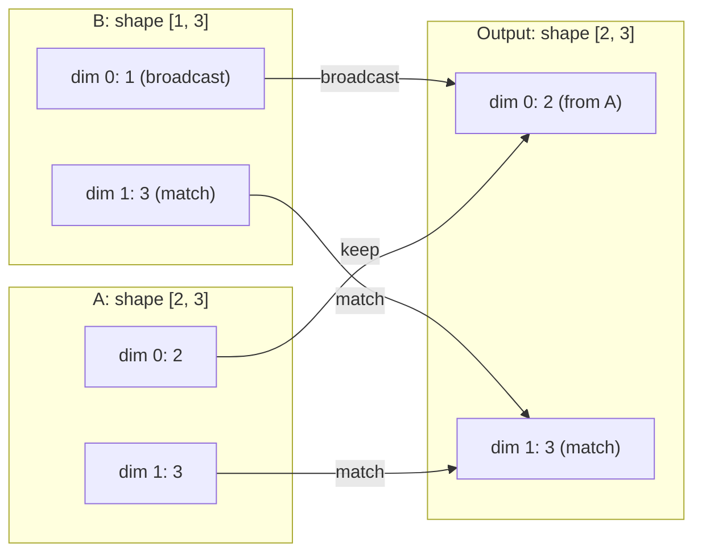
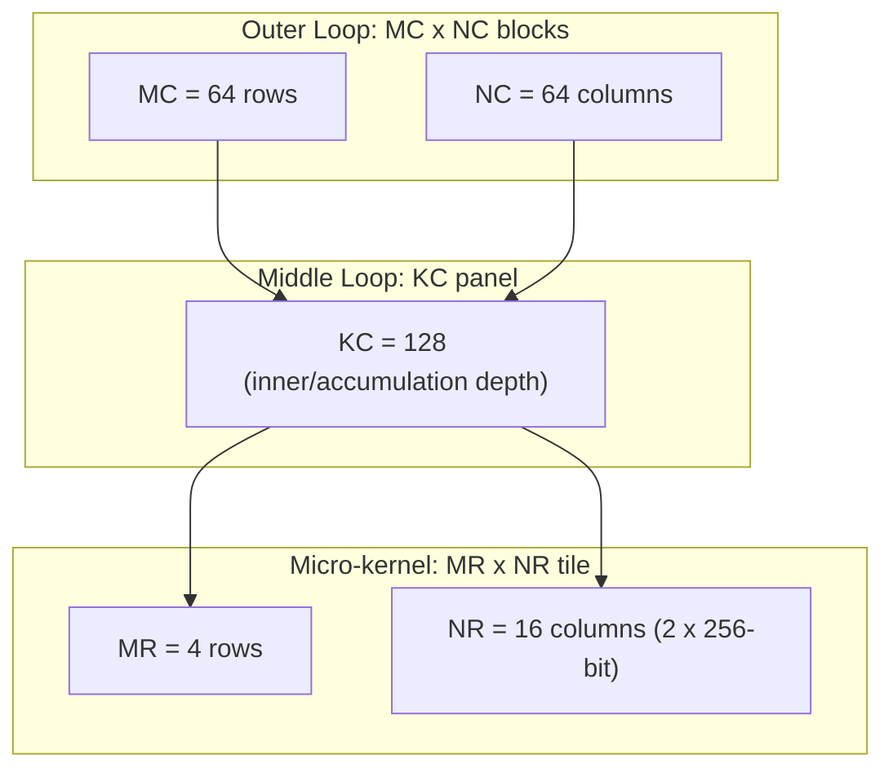
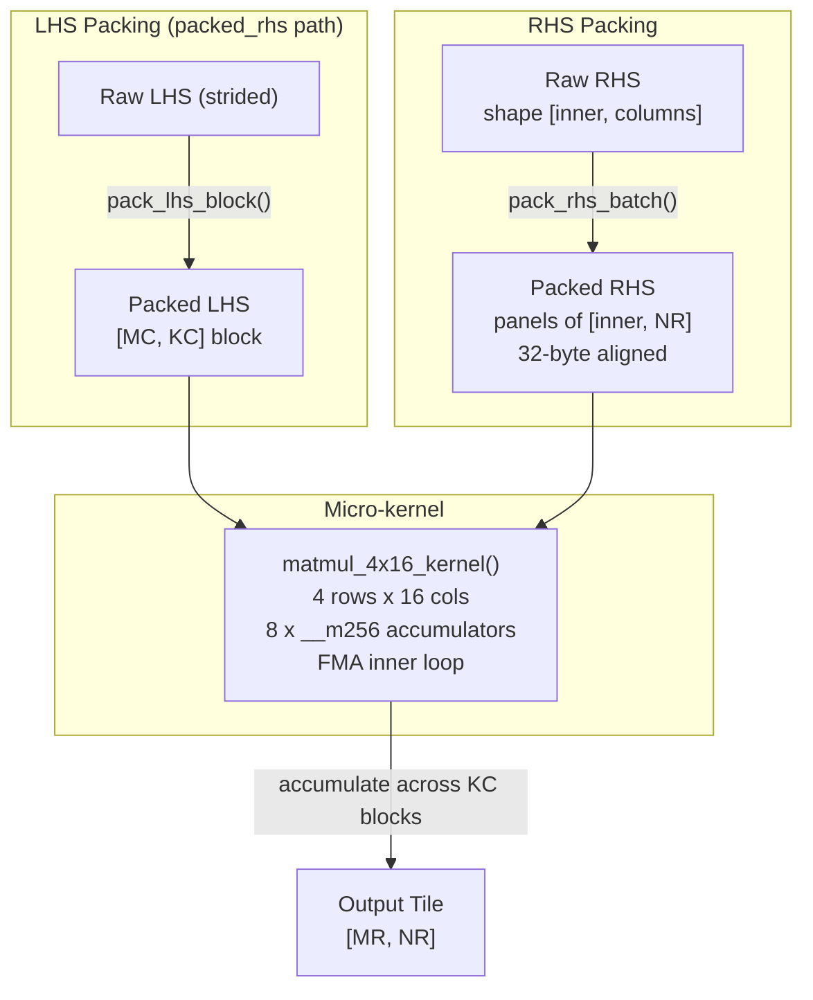

# Tensor Mechanics

The tensor component is the foundation of TensorLib. Every higher-level subsystem -- autograd, optimizers, neural-network layers -- operates on `tensor` objects managed by this layer. This document covers the data structures, memory model, view semantics, element-wise and reduction operations, matrix multiplication kernel, and the public API.

---

## Table of Contents

1. [Overview](#1-overview)
2. [Core Data Structures](#2-core-data-structures)
3. [Memory Management](#3-memory-management)
4. [View Operations](#4-view-operations)
5. [Element-wise Operations](#5-element-wise-operations)
6. [Reductions](#6-reductions)
7. [Matrix Multiplication](#7-matrix-multiplication)
8. [Gather Operations](#8-gather-operations)
9. [API Reference](#9-api-reference)
10. [Test Coverage](#10-test-coverage)
11. [Design Decisions & Tradeoffs](#11-design-decisions--tradeoffs)

---

## 1. Overview

TensorLib's tensor component provides a fixed-precision (`float32`) n-dimensional array with:

- **Strided layout** -- any element can be located via `offset + sum(coords[i] * strides[i])`.
- **Zero-copy views** -- reshape, transpose, slice, squeeze, unsqueeze, and expand produce lightweight wrappers that share the underlying storage buffer.
- **Reference counting** -- storage is freed automatically when the last referencing tensor is destroyed.
- **Broadcasting** -- element-wise operations follow right-aligned NumPy-style broadcasting.
- **Hardware-accelerated matmul** -- an AVX2+FMA blocked kernel with packed-RHS optimisation, plus a portable scalar fallback.

### Comparison with Other Frameworks

| Aspect | TensorLib | [PyTorch](https://github.com/pytorch/pytorch/blob/main/aten/src/ATen/core/TensorBase.h) | [ggml](https://github.com/ggerganov/llama.cpp/blob/master/ggml/include/ggml.h) | NumPy |
|---|---|---|---|---|
| Language | C99 | C++14 (ATen) | C99 | C/Python |
| Storage object | `Storage` with refcount + version | `Storage` with refcount + allocator | Contiguous `float*` in `ggml_tensor` | `ndarray` with base |
| View mechanism | offset + strides on shared `Storage` | `TensorImpl` with `Storage` + `storage_offset` | Stride-based; views rewrite `ne`/`nb` | `ndarray` view with shared buffer |
| Broadcasting | Right-aligned (NumPy) | Right-aligned (NumPy) | Explicit loops | Right-aligned (NumPy) |
| Type system | `float32` only | Multi-dtype (`TensorImpl`) | Per-tensor `ggml_type` | Multi-dtype |

PyTorch wraps every tensor in a `TensorImpl` that holds a `Storage` pointer, an `IntArrayRef` of sizes/strides, a storage offset, and an `autograd::AutogradMeta` pointer. TensorLib takes a simpler approach: the `tensor` struct directly owns its dimension/stride arrays and offset, and the `Storage` struct carries only the raw data, a reference count, a total element count, and a monotonically increasing version counter.

ggml's `ggml_tensor` stores dimensions (`ne[4]`) and strides (`nb[4]`) inline in the struct, and the data pointer (`data`) always points to the start of the contiguous allocation. TensorLib uses dynamically allocated `dims`/`strides` arrays of arbitrary rank and an explicit offset field, enabling richer view chains (e.g., slice-then-transpose-then-reshape) without re-materialization.

---

## 2. Core Data Structures

### `Storage`

```c
typedef struct {
    float* data;       // Heap-allocated element buffer
    int    ref_count;  // Number of tensors referencing this storage
    int    size;       // Total number of float elements
    uint64_t version;  // Monotonic mutation counter (autograd stale-graph detection)
} Storage;
```

`Storage` is the shared backing buffer. When a view is created, the new tensor's `storage` pointer is set to the same `Storage` object and `ref_count` is incremented. The `version` field is incremented by `tensor_mark_modified()`; all views share the same version counter, which allows autograd to detect in-place mutations across a view chain. See [autograd_engine.md](./autograd_engine.md) for how this is used in practice.

### `tensor`

```c
typedef struct {
    Storage* storage;  // Shared backing storage (never NULL for a valid tensor)
    int      ndim;     // Number of dimensions (0 = scalar)
    int*     dims;     // Array of dimension sizes (NULL when ndim == 0)
    int*     strides;  // Array of strides in elements (NULL when ndim == 0)
    int      offset;   // Element offset into storage->data
} tensor;
```

A tensor is a lightweight descriptor. The `offset` field means a view can start part-way into the storage buffer without any data movement. Strides are measured in *elements* (not bytes), so computing a flat index is:

```c
int flat = offset;
for (int i = 0; i < ndim; i++)
    flat += coords[i] * strides[i];
```

This is implemented in `get_flat_index_nd()` (`tensor_core.c:104`).

### Structural Diagram



All three tensors -- the root and its two views -- share a single `Storage`. The transpose view achieves a different logical layout by swapping dims and strides. The slice view adjusts the offset and shrinks one dimension.

---

## 3. Memory Management

### Allocation

| Function | Purpose |
|---|---|
| `s_alloc(ndim, dims)` | Allocate a `Storage` with `ref_count = 1`, `version = 0`, and a zero-initialized `float` buffer. |
| `t_alloc(ndim, dims)` | Allocate a `tensor` with its own `Storage`, row-major strides computed via `calc_strides()`, and `offset = 0`. |
| `t_clone(t)` | Deep copy: allocate fresh storage and copy elements in logical order (respects strides/offset). |
| `init_t(c, ref)` | Initialize an already-allocated `tensor` struct to match `ref`'s shape with zero-filled storage. Used internally by autograd node constructors. |

Zero-sized tensors and negative/zero dimensions are **rejected** by `tensor_checked_numel()`. Scalars are represented as `ndim = 0` with a single-element storage.

### Reference Counting Lifecycle



When `t_free()` is called on a tensor (`tensor_alloc.c:60`):

1. If `ref_count > 1`, decrement and free only the tensor metadata (dims, strides).
2. If `ref_count == 1`, free `storage->data`, then the `Storage` struct, then the tensor metadata.

This means the last tensor to release a shared storage is responsible for freeing the data buffer.

### Cloning vs. Viewing

- **`t_clone(t)`** -- allocates a *new* `Storage`, copies every element in logical order (respecting the source's strides/offset), and returns a fully independent tensor. Mutations to the clone do not affect the original, and the clone has its own version counter.
- **View functions** (`t_transpose`, `t_slice`, etc.) -- return a new `tensor` struct that shares the original's `Storage`. The ref_count is incremented. No data is copied.

```c
tensor* a = t_alloc(2, (int[]){2, 3});
// a->storage->ref_count == 1

tensor* b = t_transpose(a, 0, 1);
// a->storage->ref_count == 2  (a and b share storage)

t_free(b);
// a->storage->ref_count == 1  (b's release)

t_free(a);
// storage is freed here
```

### Comparison with ggml

In [ggml](https://github.com/ggerganov/llama.cpp/blob/master/ggml/include/ggml.h), tensors are allocated from a fixed `ggml_context` memory pool. `ggml_new_tensor()` bumps a bump-pointer allocator; there is no reference counting -- the entire context is freed at once. TensorLib's per-tensor reference counting gives more granular lifetime control, which is important for a framework that constructs dynamic computation graphs.

---

## 4. View Operations

All view operations create a new `tensor` struct that shares the source's `Storage` via `make_view()` (`tensor_view.c:6`). The key parameters manipulated are `dims`, `strides`, and `offset`.

### `t_transpose(a, dim0, dim1)`

Swaps the size and stride of two dimensions. No data is moved.

```c
// Shape [2, 3], strides [3, 1]
tensor* t = t_transpose(a, 0, 1);
// Shape [3, 2], strides [1, 3]  -- same storage
```

The result is *not* contiguous. See `tensor_view.c:31`.

### `t_reshape(a, new_ndim, new_dims)`

Changes the shape while preserving element order. Total element count must match.

- If `a` is contiguous: returns a zero-copy view with new strides (`tensor_view.c:80`).
- If `a` is not contiguous: clones the data into a fresh contiguous buffer with the new shape (`tensor_view.c:86`). This is the safe default -- PyTorch behaves identically.

### `t_squeeze(a, dim)`

Removes a dimension of size 1. The corresponding stride entry is removed from the stride array.

### `t_unsqueeze(a, dim)`

Inserts a size-1 dimension at position `dim`. The new stride is computed to maintain contiguous layout: `strides[dim] * dims[dim]` (or `1` at the trailing edge).

### `t_expand(a, new_ndim, new_dims)`

Creates a zero-copy view where size-1 dimensions are broadcast by setting their stride to **zero**. This is the same mechanism NumPy and PyTorch use -- a zero stride means every index along that axis reads the same element.

```c
tensor* a = t_alloc(2, (int[]){2, 1});  // shape [2, 1]
tensor* b = t_expand(a, 2, (int[]){2, 3});
// b has shape [2, 3], strides [1, 0]
// All three columns of each row read the same value
```

Dimensions that already match are kept unchanged. Leading dimensions not present in the source are given stride 0 (implicit size-1 broadcast). See `tensor_view.c:211`.

### `t_slice(a, dim, start, end)`

Returns a view into a sub-range along `dim`. The offset is advanced by `start * strides[dim]`, and the size of `dim` becomes `end - start`. All other dimensions and strides are unchanged.

```c
tensor* a = t_alloc(2, (int[]){3, 4});
tensor* s = t_slice(a, 0, 1, 3);
// s has shape [2, 4], offset = 1 * 4 = 4
```

### `t_contiguous(t)`

- If `t` is already contiguous: returns a zero-copy view (shares storage, bumps ref_count).
- If `t` is not contiguous: returns a deep copy in row-major order via `t_clone()`.

### How Views Share Storage



The transpose swaps strides, the slice adjusts offset and shrinks a dimension, and the expand sets a stride to zero -- all without copying data.

### Comparison with NumPy / PyTorch

NumPy's `ndarray.view()` creates a view by manipulating strides and offset, exactly like TensorLib. PyTorch's `as_strided()` does the same at the C++ level. TensorLib follows this well-established model, simplified to a single dtype.

---

## 5. Element-wise Operations

### Binary Operations (Arithmetic)

| Function | Operator |
|---|---|
| `t_add(a, b)` | `a + b` |
| `t_sub(a, b)` | `a - b` |
| `t_mul(a, b)` | `a * b` |
| `t_div(a, b)` | `a / b` |

All binary operations:
1. Compute the broadcast output shape via `broadcast_output_shape()` (`tensor_ops.c:42`).
2. Allocate the output tensor.
3. Fast-path: if both inputs and the output have the *same shape and same strides*, use a contiguous SIMD-friendly loop (`add_contiguous`, etc.).
4. Slow-path: iterate over every output element using `advance_coords()` and resolve each input element via `input_index_for_broadcast()` (`tensor_ops.c:76`), which handles size-1 dimension broadcasting by clamping the coordinate to 0.

**Scalar variants** (`t_add_scalar`, `t_sub_scalar`, `t_mul_scalar`, `t_div_scalar`) avoid allocating a scalar tensor and operate element-wise with a constant float.

### Broadcasting Rules

TensorLib uses **right-aligned, NumPy-style broadcasting**. When two operands have different ranks, the shorter tensor is conceptually prepended with dimensions of size 1. Two dimensions are compatible if they are equal or one of them is 1. The output dimension is the maximum of the two.



**Example:** `a` has shape `[2, 1]` and `b` has shape `[1, 3]`. The output has shape `[2, 3]`. Each row of `a` is added to each column of `b`.

This is tested extensively in `test_tensor_ops.c` with cases including rank-0 (scalar) tensors, transposed inputs, and expanded inputs.

### Unary Operations (Activations)

| Function | Formula |
|---|---|
| `t_exp(t)` | `exp(x)` |
| `t_log(t)` | `log(x)` |
| `t_relu(t)` | `max(0, x)` |
| `t_tanh(t)` | `tanh(x)` |
| `t_sigmoid(t)` | `1 / (1 + exp(-x))` |
| `t_gelu(t)` | `0.5 * x * (1 + tanh(sqrt(2/pi) * (x + 0.044715 * x^3)))` |
| `t_pow(t, exp)` | `x^exp` |
| `t_neg(t)` | `-x` |
| `t_sqrt(t)` | `sqrt(x)` |

All unary operations first materialize the input into a contiguous copy via `t_contiguous()`, apply the function element-wise, and return the output. This avoids branch-heavy strided iteration at the cost of one copy when the input is non-contiguous. IEEE-754 domain results (NaN, -Inf for `log(0)`, NaN for `sqrt(-1)`) are preserved faithfully, as verified by the test suite.

---

## 6. Reductions

| Function | Behavior |
|---|---|
| `t_sum(a, dim)` | Sum along `dim`, **remove** the reduced axis |
| `t_mean(a, dim)` | Mean along `dim`, **remove** the reduced axis |
| `t_max(a, dim)` | Max along `dim`, **remove** the reduced axis |
| `t_sum_keepdim(a, dim)` | Sum along `dim`, **keep** the reduced axis with size 1 |
| `t_mean_keepdim(a, dim)` | Mean along `dim`, **keep** the reduced axis with size 1 |
| `t_max_keepdim(a, dim)` | Max along `dim`, **keep** the reduced axis with size 1 |

### Implementation

Reductions iterate over the output element count. For each output coordinate, the reduced dimension index is set to 0, and a loop accumulates (sum) or compares (max) across all values along that axis (`tensor_reduc.c:33-118` for sum, `tensor_reduc.c:161-258` for max). `t_mean` simply calls `reduce_sum` and divides by the reduction dimension size.

The `keepdim` variants use `make_reduction_dims()` to compute the output shape, setting the reduced dimension to 1 instead of removing it.

### Interaction with Autograd

Reduction gradients broadcast the upstream gradient back to the input shape. For `t_sum`, the gradient is the upstream broadcast to the original shape. For `t_max`, the gradient is scattered only to the positions that held the maximum value. The `keepdim` variants are especially important here -- they produce output shapes that broadcast cleanly against the input shape during the backward pass. See [autograd_engine.md](./autograd_engine.md) for details.

### IEEE-754 Behavior

- **`t_sum`**: NaN propagation (any NaN in the reduction window produces NaN in the output).
- **`t_max`**: NaN propagation (if any element is NaN, the result is NaN). `-INFINITY` is handled correctly for all-negative or mixed-infinity inputs.

---

## 7. Matrix Multiplication

TensorLib provides a multi-level matrix multiplication system, from a portable scalar fallback to a highly optimized AVX2+FMA microkernel.

### API

| Function | Description |
|---|---|
| `t_matmul(a, b)` | General matrix multiply with batch broadcasting. Handles vectors, matrices, and batched inputs. |
| `t_pack_matmul_rhs(rhs)` | Pre-pack the RHS into panel format for reuse across multiple matmul calls. |
| `t_matmul_packed_rhs(lhs, rhs)` | Matmul using a pre-packed RHS. |
| `t_free_matmul_packed_rhs(rhs)` | Free the packed RHS buffer. |

### Kernel Architecture

The matmul system is implemented in `tensor_matmul.c` and uses a three-level tiling strategy inspired by [OpenBLAS's sgemm microkernel](https://github.com/OpenMathLib/OpenBLAS/blob/master/kernel/x86_64/sgemm_kernel_4x16_haswell.c):



| Parameter | Value | Rationale |
|---|---|---|
| `MR` | 4 | Number of rows processed per micro-kernel invocation. Keeps 4 accumulators (one per row) in YMM registers. |
| `NR` | 16 | Number of columns per micro-kernel. Two 256-bit FMA vectors cover 16 floats. |
| `MC` | 64 | Row block size. Fits L1 cache (64 * 128 * 4B = 32KB for the LHS panel). |
| `NC` | 64 | Column block size. |
| `KC` | 128 | Inner dimension block. Controls packing granularity. |

### The AVX2+FMA Micro-kernel

The `matmul_4x16_kernel()` function (`tensor_matmul.c:414`) processes a 4x16 tile of the output:

```c
// For each k in [0, k_count):
//   Load broadcast a[row][k] into __m256
//   Load packed b[k][0:16] into two __m256
//   FMA into 8 accumulators (4 rows x 2 column groups)
for (int k = 0; k < k_count; ++k) {
    __m256 b0 = _mm256_loadu_ps(b + 0);
    __m256 b1 = _mm256_loadu_ps(b + 8);
    __m256 a0_value = _mm256_broadcast_ss(a0 + k);
    c00 = _mm256_fmadd_ps(a0_value, b0, c00);
    c01 = _mm256_fmadd_ps(a0_value, b1, c01);
    // ... rows 1-3 ...
}
```

This is an outer-product formulation: each iteration of `k` broadcasts one element of the LHS row and multiplies it against all NR elements of the packed RHS, accumulating into the 4x16 output tile.

### Packed RHS Optimization

The `t_pack_matmul_rhs()` function (`tensor_matmul.c:111`) reorganizes the RHS into panels of size `[inner, NR]`, with zero-padding for tail columns. This eliminates stride-guessing in the hot loop and improves cache locality. The packed buffer is 32-byte aligned on Windows (`_aligned_malloc`) for optimal AVX2 loads.

When `t_matmul()` detects that both operands are contiguous matrices and AVX2 is available, it transparently packs the RHS internally via `try_packed_matrix_matmul()` (`tensor_matmul.c:903`). For non-contiguous operands (e.g., transposed views), it falls back to `matmul_2d_strided()` which handles arbitrary strides.

The `t_matmul_packed_rhs()` path also packs the LHS block (`pack_lhs_block()`, `tensor_matmul.c:655`) into a temporary buffer of size `MC * KC`, then invokes `matmul_4x16_packed_a_kernel()` -- a variant microkernel that reads both operands from packed buffers. Tail rows/columns (where `rows % MR != 0` or `columns % NR != 0`) are handled by `matmul_2d_packed_rhs_scalar_tails()` (`tensor_matmul.c:671`).

### Batched and Broadcast Matmul

`t_matmul()` supports arbitrary batch dimensions. It decomposes each operand into `matmul_operand_info`:

```c
typedef struct {
    int is_vector;    // 1D input (promoted to row or column vector)
    int batch_rank;   // ndim - 2 for matrices, 0 for vectors
    int rows;         // Last-2 dimension
    int inner;        // Last-1 dimension (contraction dimension)
    int columns;      // Last dimension
} matmul_operand_info;
```

Batch dimensions are broadcast using the same right-aligned rule as element-wise ops. For each batch coordinate, the appropriate offsets into the LHS, RHS, and output are computed, and a 2D matmul is dispatched.

**Vector promotion**: 1D inputs are promoted to row vectors (left) or column vectors (right). `vector x vector` produces a scalar (0D output). This matches NumPy/PyTorch semantics.

### Tiling Strategy Diagram



### Comparison with ggml

[ggml](https://github.com/ggerganov/llama.cpp/blob/master/ggml/include/ggml.h) dispatches `ggml_mul_mat` through a type-based kernel table (`ggml_compute_forward_mul_mat`), selecting kernels for different quantization types (Q4_0, Q8_0, F16, F32). TensorLib operates exclusively in F32 and selects between AVX2 and scalar at runtime based on CPUID detection (`matmul_avx2_available()`, `tensor_matmul.c:390`). The ggml approach is optimised for quantized inference; TensorLib's approach is optimised for full-precision training.

### Comparison with OpenBLAS

[OpenBLAS's Haswell sgemm kernel](https://github.com/OpenMathLib/OpenBLAS/blob/master/kernel/x86_64/sgemm_kernel_4x16_haswell.c) also uses MR=4, NR=16 with FMA inner loops -- the same microkernel dimensions. TensorLib's tiling parameters (MC=64, NC=64, KC=128) are chosen for L1/L2 cache fit on modern x86. OpenBLAS additionally handles prefetch, register tiling across multiple K-blocks, and multi-threading; TensorLib keeps the implementation simpler for now.

---

## 8. Gather Operations

### `t_gather_rows(table, indices)`

Selects rows from a rank-2 `table` (shape `[N, W]`) using `indices` of any rank. Indices must be finite, integral float values in `[0, N)`.

**Output shape**: `indices.shape + [W]`

```c
tensor* table = t_alloc(2, (int[]){4, 8});   // 4 rows, 8 columns
tensor* idx  = t_alloc(2, (int[]){2, 3});    // 2x3 index tensor
tensor* out  = t_gather_rows(table, idx);     // shape [2, 3, 8]
```

This is the building block for embedding lookups, attention mask indexing, and similar operations. The implementation (`tensor_gather.c:20`) iterates over all indices, validates each one (rejecting NaN, Inf, out-of-range, or non-integer values), and copies the corresponding table row into the output.

---

## 9. API Reference

### Allocation & Lifetime

| Signature | Description |
|---|---|
| `Storage* s_alloc(int ndim, const int* dims)` | Allocate storage for `prod(dims)` floats, ref_count = 1. |
| `tensor* t_alloc(int ndim, const int* dims)` | Allocate a tensor with its own storage and row-major strides. |
| `void t_free(tensor* t)` | Release a tensor (decrements storage ref_count; frees storage if last reference). NULL-safe. |
| `tensor* t_clone(tensor* t)` | Deep copy; allocates independent storage and copies elements in logical order. |
| `int init_t(tensor* c, tensor* ref)` | Initialize `c` to match `ref`'s shape with zero-filled storage. Returns 0 on success. |
| `void add_ref_count(Storage* a, tensor* b)` | Link `b` to storage `a` and increment ref_count. |
| `void tensor_mark_modified(tensor* value)` | Increment storage version counter (autograd mutation detection). |

### Core Utilities

| Signature | Description |
|---|---|
| `int tensor_numel(tensor* t)` | Return total element count, or 0 for invalid tensors. |
| `int is_contiguous(tensor* t)` | Returns 1 if strides match row-major layout. |
| `void calc_strides(int ndim, const int* dims, int* strides)` | Compute row-major strides. |
| `int get_flat_index_nd(tensor* t, int* coords)` | Compute flat storage index from n-dimensional coordinates. |
| `int same_shape(tensor* a, tensor* b)` | 1 if both have identical ndim and dims. |
| `int same_stride(tensor* a, tensor* b)` | 1 if both have identical ndim and strides. |
| `void advance_coords(int* coords, const int* dims, int ndim)` | Increment n-dimensional coordinate by one position (row-major order). |
| `int tensor_has_valid_shape(const tensor* t)` | Validate dimensions are positive and non-overflowing. |
| `int tensor_has_valid_layout(const tensor* t)` | Validate shape + non-negative strides/offset. |
| `int tensor_has_valid_metadata(const tensor* t)` | Full validation: layout + storage bounds check. |
| `int tensor_checked_numel(int ndim, const int* dims, size_t* result)` | Compute numel with overflow and positivity checks. |
| `int tensor_copy_metadata(int ndim, const int* dims, const int* strides, int** out_dims, int** out_strides)` | Deep-copy dims and strides arrays. Returns 0 on success. |

### View Operations

| Signature | Description |
|---|---|
| `tensor* t_transpose(tensor* a, int dim0, int dim1)` | Swap two dimensions (zero-copy view). |
| `tensor* t_reshape(tensor* a, int new_ndim, int* new_dims)` | Change shape; view if contiguous, clone otherwise. |
| `tensor* t_squeeze(tensor* a, int dim)` | Remove a size-1 dimension. |
| `tensor* t_unsqueeze(tensor* a, int dim)` | Insert a size-1 dimension at `dim`. |
| `tensor* t_expand(tensor* a, int new_ndim, const int* new_dims)` | Broadcast via zero strides. |
| `tensor* t_slice(tensor* a, int dim, int start, int end)` | Sub-range view along `dim`. |
| `tensor* t_contiguous(tensor* t)` | View if already contiguous, clone otherwise. |

### Element-wise Operations

| Signature | Description |
|---|---|
| `tensor* t_add(tensor* a, tensor* b)` | Element-wise addition with broadcasting. |
| `tensor* t_sub(tensor* a, tensor* b)` | Element-wise subtraction with broadcasting. |
| `tensor* t_mul(tensor* a, tensor* b)` | Element-wise multiplication with broadcasting. |
| `tensor* t_div(tensor* a, tensor* b)` | Element-wise division with broadcasting. |
| `tensor* t_add_scalar(tensor* a, float scalar)` | Add scalar to every element. |
| `tensor* t_sub_scalar(tensor* a, float scalar)` | Subtract scalar from every element. |
| `tensor* t_mul_scalar(tensor* a, float scalar)` | Multiply every element by scalar. |
| `tensor* t_div_scalar(tensor* a, float scalar)` | Divide every element by scalar. |
| `tensor* t_exp(tensor* t)` | Element-wise exp. |
| `tensor* t_log(tensor* t)` | Element-wise log. |
| `tensor* t_relu(tensor* t)` | Element-wise ReLU. |
| `tensor* t_tanh(tensor* t)` | Element-wise tanh. |
| `tensor* t_sigmoid(tensor* t)` | Element-wise sigmoid. |
| `tensor* t_gelu(tensor* t)` | Element-wise GELU (tanh approximation). |
| `tensor* t_pow(tensor* t, float exponent)` | Element-wise power. |
| `tensor* t_neg(tensor* t)` | Element-wise negation. |
| `tensor* t_sqrt(tensor* t)` | Element-wise square root. |

### Reductions

| Signature | Description |
|---|---|
| `tensor* t_sum(tensor* a, int dim)` | Sum along axis, remove it. |
| `tensor* t_mean(tensor* a, int dim)` | Mean along axis, remove it. |
| `tensor* t_max(tensor* a, int dim)` | Max along axis, remove it. |
| `tensor* t_sum_keepdim(tensor* a, int dim)` | Sum along axis, keep size-1. |
| `tensor* t_mean_keepdim(tensor* a, int dim)` | Mean along axis, keep size-1. |
| `tensor* t_max_keepdim(tensor* a, int dim)` | Max along axis, keep size-1. |

### Matrix Multiplication

| Signature | Description |
|---|---|
| `tensor* t_matmul(tensor* a, tensor* b)` | General matmul with batch broadcasting and vector promotion. |
| `tensor_matmul_packed_rhs* t_pack_matmul_rhs(const tensor* rhs)` | Pre-pack RHS into panel format. |
| `tensor* t_matmul_packed_rhs(const tensor* lhs, const tensor_matmul_packed_rhs* rhs)` | Matmul with pre-packed RHS. |
| `void t_free_matmul_packed_rhs(tensor_matmul_packed_rhs* rhs)` | Free packed RHS buffer. |

### Gather

| Signature | Description |
|---|---|
| `tensor* t_gather_rows(tensor* table, tensor* indices)` | Row-lookup from a rank-2 table. Output shape is `indices.shape + [table_width]`. |

---

## 10. Test Coverage

Each source file in `src/tensor/` has a corresponding test file in `tests/unit/tensor/`. Tests use a lightweight `TEST()`/`RUN_TEST()`/`ASSERT_*` macro framework (defined in `tests/fixtures/test_common.h`).

### `test_tensor_alloc.c` (17 tests)

Covers:
- `s_alloc` basic allocation, ndim-0 scalar, null-dims rejection, non-positive and overflowing dimensions
- `t_alloc` shape/strides correctness, scalar allocation, negative ndim rejection
- `t_free` null safety, shared-storage ref_count decrement
- `init_t` shape copy, zero-fill, null-argument safety
- `t_clone` deep copy independence, strided-view materialization, version counter independence
- `add_ref_count` linking, null safety

### `test_tensor_core.c` (18 tests)

Covers:
- `calc_strides` for 1D, 3D, and ndim-0 (no-op)
- `advance_coords` normal increment, carry, and wrap-around
- `get_flat_index_nd` contiguous and strided lookup, null safety
- `same_shape` and `same_stride` true/false cases, null args
- `is_contiguous` row-major true, transposed false, null
- `tensor_numel` rejection of negative, zero, and overflowing shapes

### `test_tensor_view.c` (18 tests)

Covers:
- `t_transpose` dims/strides swap, storage sharing, ref_count, contiguity loss, bounds checking, null input
- `t_contiguous` on contiguous (view returned) and transposed (clone), null
- `t_reshape` contiguous input (view), strided input (clone), element count mismatch, invalid/overflowing dims
- `t_slice` offset/strides correctness, invalid arguments
- `t_unsqueeze` dimension insertion, stride computation, axis bounds
- `t_expand` size-1 broadcasting, stride=0, leading dimensions, incompatible shapes

### `test_tensor_ops.c` (15 tests)

Covers:
- `t_add` contiguous, independent storage, strided (transposed) input, shape mismatch
- Broadcasting: singleton dimensions, strided + expanded inputs, rank-0 scalar tensors
- Scalar helpers: `t_add_scalar`, `t_sub_scalar`, `t_mul_scalar`, `t_div_scalar`
- `t_sub`, `t_mul`, `t_div` with IEEE edge cases (NaN, +Inf, 0/0)
- All binary ops with transposed inputs (logical order verification)
- Unary ops (`t_neg`, `t_sqrt`, `t_exp`, `t_log`, `t_relu`, `t_gelu`, `t_sigmoid`, `t_tanh`, `t_pow`): contiguous values, transposed inputs, IEEE-754 domain results
- Null-input rejection for all operations

### `test_tensor_reduc.c` (21 tests)

Covers:
- `t_sum` every axis of a 3D tensor, 1D to scalar, unit reduction dimension
- `t_sum` on transposed, sliced, reshaped, unsqueezed, squeezed, and expanded views
- `t_sum` IEEE-754 NaN propagation
- `t_mean` floating-point division, strided views, null/invalid args
- `t_max` every axis, 1D with negative values, unit dimension, transposed/offset views, expanded broadcast
- `t_max` NaN propagation, infinity handling (-Inf, +Inf, all-negative-Inf)
- `keepdim` variants for sum, mean, max: output shape preservation, views, rank-1 inputs

### `test_tensor_matmul.c` (15 tests)

Covers:
- 2D matmul correctness
- 3D batched matmul
- Batch dimension broadcasting (4D with singleton dims)
- Transposed views as inputs
- Vector cases: dot product (1D x 1D -> 0D), matrix-vector, vector-matrix
- Packed RHS: snapshot of transposed view, transposed slices with kernel tails, non-multiple kernel dimensions (5x129 * 129x17), reshape/squeeze/unsqueeze chains, batch broadcasting, materialized contiguous views
- Packed RHS rejection of zero-stride (expanded) and non-matrix RHS
- Invalid shape rejection (mismatched inner dims, incompatible batches, scalars)
- Vector inner dimension validation
- Aliased input (self-matmul) with independent output storage

### Key Test Patterns

1. **Shape and value verification**: Allocate, fill, operate, check ndim, dims, and every element.
2. **Storage independence**: Assert `c->storage != a->storage` after operations.
3. **View chain testing**: Transpose-then-slice-then-reshape chains to verify offset/stride correctness.
4. **IEEE-754 domain checks**: NaN propagation, infinity handling, `0.0/0.0 = NaN`, `x/0.0 = +Inf`.
5. **Null and boundary rejection**: Pass NULL, negative dims, zero dims, overflow dims, out-of-range axes.

---

## 11. Design Decisions & Tradeoffs

### Why C99?

C99 provides the minimal runtime and maximum portability needed for a tensor library that may be embedded in larger C/C++ projects. Features like `restrict`, `stdint.h`, `stdbool.h`, compound literals, and variable-length arrays (used sparingly) are sufficient. The choice avoids C++ ABI complications and makes the library trivially linkable from any language with a C FFI.

### Why Not Use BLAS?

A built-in matmul implementation gives full control over:

1. **View-aware dispatch** -- the kernel can operate directly on strided inputs without requiring the caller to materialize contiguous copies. BLAS routines like `sgemm` require leading-dimension parameters that don't map cleanly to arbitrary stride patterns.
2. **Batch integration** -- the batch loop is tightly integrated with the kernel dispatch, avoiding per-batch allocations.
3. **Packed RHS lifecycle** -- the packed buffer format is owned by TensorLib and managed through its own API, enabling the `t_pack_matmul_rhs` / `t_matmul_packed_rhs` workflow.
4. **Deployment simplicity** -- no dependency on external BLAS libraries, which simplifies linking on Windows, embedded systems, and CI environments.

The AVX2+FMA kernel achieves competitive performance for the matrix sizes typical in deep learning workloads. For very large matrices, users can swap in a BLAS-backed implementation without changing the public API.

### Storage Version Counter for Stale-Graph Detection

The `version` field in `Storage` is incremented by `tensor_mark_modified()`. Since all views share the same storage, modifying one view bumps the version visible to all others. This enables the autograd engine to detect in-place mutations that would invalidate cached intermediate values in the computation graph. See [autograd_engine.md](./autograd_engine.md).

### Why Right-Aligned Broadcasting?

Right-aligned (trailing-dimension) broadcasting is the convention established by NumPy and adopted by PyTorch, TensorFlow, and JAX. It aligns the *innermost* dimensions, which correspond to the most frequently computed axes (spatial, channel, feature). Right-aligned broadcasting means the most common patterns -- adding a bias vector to a batch of activations, scaling a matrix by a scalar -- require no transposition or shape manipulation by the caller.

### Element Count Validation

TensorLib intentionally rejects tensors with zero-sized dimensions or total element count exceeding `INT_MAX`. This avoids subtle bugs where zero-sized tensors create empty storage objects (which can cause division-by-zero in reductions or degenerate pointer arithmetic in kernels), and ensures all dimension and offset arithmetic stays within `int` range for predictable behavior.
